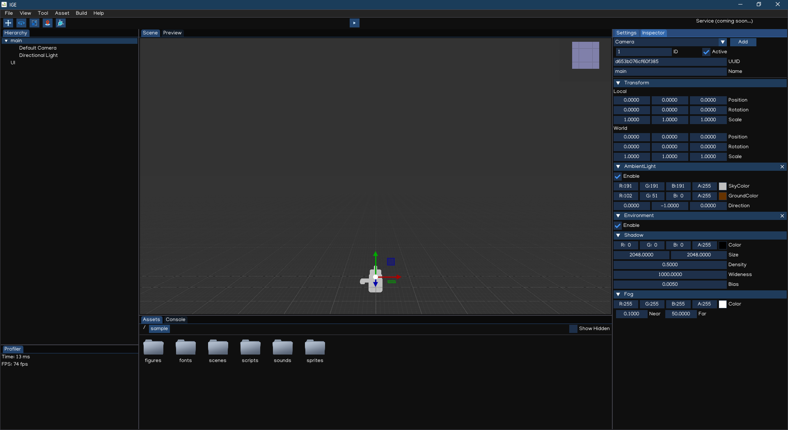

Your First Scene
================

Create Project
--------------

Go to the menu bar: ``File -> New Project`` to create new project. This action also create new empty scene for the newly created project.

This scene is composed of two object: a directional light, and a camera.

Having a camera in a scene is essential for the game to show something onto the screen.

You can go to the menu bar: ``File -> Save Scene`` to save the scene. Then you can click the `Play` button in the `Toolbar` to preview the scene.

A project can contain multiple scenes. To create a new scene, go to ``File -> New Scene``. To load a scene, go to ``File -> Load Scene`` or just drag a file with `.scene` extension in the `Scene View`.

To change a scene at runtime, we need to use Scripting :doc:`api` which will be introduced later.

Creating Game Object
--------------------

