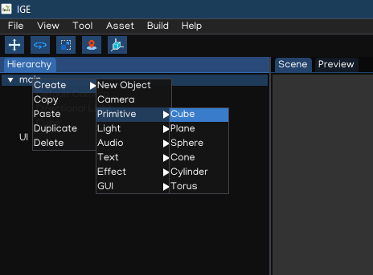

Your First Scene
================

Create Project
--------------

Go to the menu bar: ``File -> New Project`` to create new project. This action also create new empty scene for the newly created project.

This scene is composed of two object: a directional light, and a camera.

Having a camera in a scene is essential for the game to show something onto the screen.

You can go to the menu bar: ``File -> Save Scene`` to save the scene. Then you can click the `Play` button in the `Toolbar` to preview the scene.

A project can contain multiple scenes. To create a new scene, go to ``File -> New Scene``. To load a scene, go to ``File -> Load Scene`` or just drag a file with `.scene` extension in the `Scene View`.

To change a scene at runtime, we need to use :doc:`api` which will be introduced later.

Project Structure
------------------

.. table::
   :widths: auto

   =============  =================================
    Item           Meaning
   =============  =================================
   config          [Folder] Contains project's configuration.
   figures         [Folder] Contains models and animations.
   fonts           [Folder] Contains fonts used in the project.
   scenes          [Folder] Contains scene files.
   scripts         [Folder] Contains game logic source codes.
   sounds          [Folder] Contains audio files.
   sprites         [Folder] Contains UI and 2D images.
   \*.igeproj      [File] The project file
   =============  =================================

Create Object
-------------

In order to add an object to the scene, select and right-click an item in Hierarchy, select ``Create -> Primitive -> Cube``.

You should now see a cube in your scene.

Scripting
---------

To control behavior of an object, we use Script Component.

In the Inspector, add new Script Component.

In the Asset Browser, go to ``scripts``, right-click then select ``New Script``, then name it ``move.py``.

Open the newly created file, edit it with content below:

.. code:: python

   import math
   import igeVmath as vmath   
   from igeScene import Script

   class Move(Script):
      def __init__(self, owner):
         super().__init__(owner)
         self.elapsed = 0.0

      def onUpdate(self, dt):
         self.elapsed = self.elapsed + dt
         self.owner.transform.position = vmath.vec3(0, math.sin(self.elapsed), 0)

Then drag the file in Script component Inspector.

Save the scene, by pressing ``Ctrl + S`` or ``File -> Save Scene``. Then you can press the ``Play`` button to test it, the cube should keep moving up and down follow ``sin`` pattern continuosly.