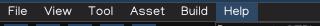
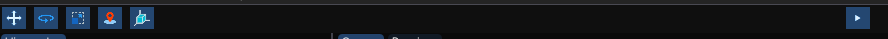
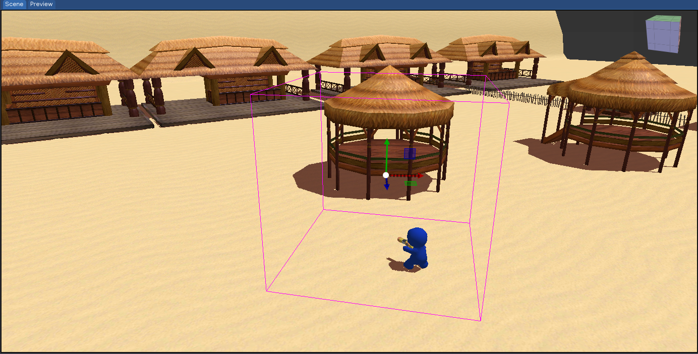
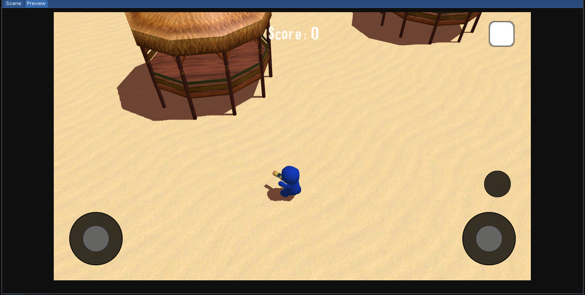
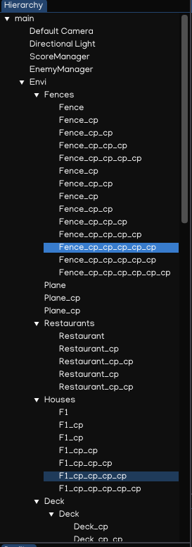
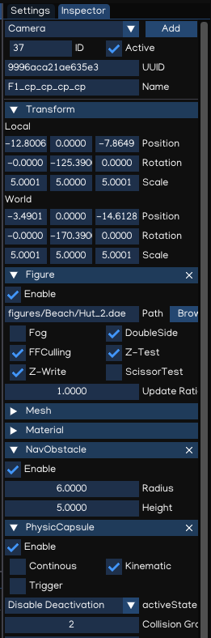
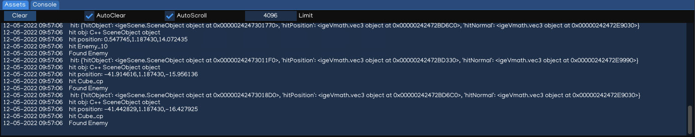
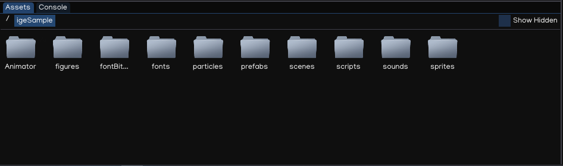

Editor Layout
==============

When launching igeCreator for the first time, you will see the Editor window similar to this:

.. figure:: images/editor_layout.png
   :alt: Editor Layout

Menu Bar
---------

Menu Bar provides some functions to control the editor windows, as well as tools and other settings related to the scene.

Toolbar
--------

Toolbar provides controls onto your scene. It allows you to play, pause, resume, stop the game preview. It also alows changing `Gizmo` and `Camera` modes.

Scene View
-----------

The Scene View is the main view of igeCreator editor. It will give you a real-time feedback of what is happening in your current scene while manipulate the objects and settings using the editor.

To asjust the editor camera, use controls below:

.. table::
   :widths: auto

   =============  =================================
    Action         Input
   =============  =================================
   Rotate          [Mouse] Drag Right Button
   Zoom            [Mouse] Scroll Middle Button
   Move            [Mouse] Drag Middle Button
   Focus           [Keyboard] Press `F` Key
   =============  =================================

To add game object to the scene, just drag and drop the asset files in the scene view, based on the file type the engine will create game object and attach relevant component(s) automatically.

The game object can also be added to the scene by seleting and right-clicking the parent object to show the ``Create Menu`` with various types of object to create.

.. figure:: images/new_cube.png
   :alt: Create Menu

Also, the object can be manipulated with actions below:

.. table::
   :widths: auto

   =============  =================================
    Action         Input
   =============  =================================
   Select          [Mouse] Click Left Button
   Multi Select    [Mouse] Drag Left Button
   Copy            [Keyboard] Press `Ctrl + C` Key
   Paste           [Keyboard] Press `Ctrl + V` Key
   Duplicate       [Keyboard] Press `Ctrl + D` Key
   Delete          [Keyboard] Press `Del` Key
   =============  =================================

Game Preview
-------------

The Preview, like the Scene View, reflects what is happening in your scene, from your game active camera. The editor will automatically focus the Preview when playing the scene.

.. note::
   The GUI layer is hidden in editing mode, so that developer can focus on adjusting the 3D scene. In playing mode, the game will be played just like it will be on devices.

Hierarchy
----------

The `Hierarchy` window shows the current scene hierarchy with relations between objects. Besides, you can also create/select/delete/move/copy/paste/drag objects in this view.

User can select object by clicking the item in the tree. Multiple selection can be done with with help of using ``Ctrl`` and ``Shift`` keys.

User can also drag and drop object to create parent-children relationship in the hierarchy tree. Assets drag and drop in hierarchy is also implemented.

To create prefab, just simply drag the item in hierarchy to ``prefabs`` folder in the Assets Browser.

.. tip::
   To focus the camera on an object in complex scene, select it node in hierarchy and press ``F`` key.

Inspector
----------

In the `Inspector` you'll be able to view and edit the currently selected object. Adding, tweaking and removing components, changing object settings (name, tag, transform...).

All the object has ``Transform`` component by default. The GUI element will have ``RectTransform`` which is a derivative of ``Transform`` component specilized for 2D and GUI. 

Besides, there are various types of component which can be added into a game object, such as:

.. table::
   :widths: auto

   ======================  ============================================
    Component               Usage
   ======================  ============================================
   Camera                    Camera in game
   Figure                    Model (IGE Engine format)
   Sprite                    Sprite in game
   Animator                  Animation controller
   Particle                  Particle effect
   Script                    Scripting, to control object's behavior
   Text                      Text in game, using TTF or Bitmap
   AmbientLight              Ambient Light
   DirectionalLight          Directional Light
   PointLight                Point Light
   SpotLight                 Spot Light
   AudioSource               Audio source
   AudioListener             Audio Listener
   Canvas                    Canvas for rendering GUI
   UIImage                   GUI Image
   UIText                    GUI Text
   UITextField               GUI Text Field
   UIButton                  GUI Button
   UISlider                  GUI Slider
   UIScrollView              GUI Scroll View
   UIScrollBar               GUI Scroll Bar
   UIMask                    GUI Mask
   PhysicBox                 Physic Box collider
   PhysicSphere              Physic Sphere collider
   PhysicCapsule             Physic Capsule collider
   PhysicMesh                Physic Mesh collider
   PhysicSoftBody            Physic Soft-Body and cloth simulation
   Navigable                 Mark object/mesh as navigable
   NavMesh                   Navigation mesh
   DynamicNavMesh            Dynamic navigation mesh
   NavAgent                  Navigation agent
   NavObstacle               Navigation obstacle
   NavArea                   Mark the navigation area
   OffMeshLink               Link between navigation areas
   ======================  ============================================

.. note::
   Usage of each component will be discussed in ``Tutorials`` sections.

Console
--------

Show log from the engine as well as the game so that it's easier for developer to debug.

.. note::
   The console reflects the log from Python API, so to print the log user just need to use ``print()`` function from Python API.

Asset Browser
--------------
Provides access to all assets of the project. User can create/move/delete files as well as using right-clicking context menu to perform various actions.

The Asset Browser allows you to drag and drop assets to places like `Scene View` to create object, or `Inspector` to configure object...

