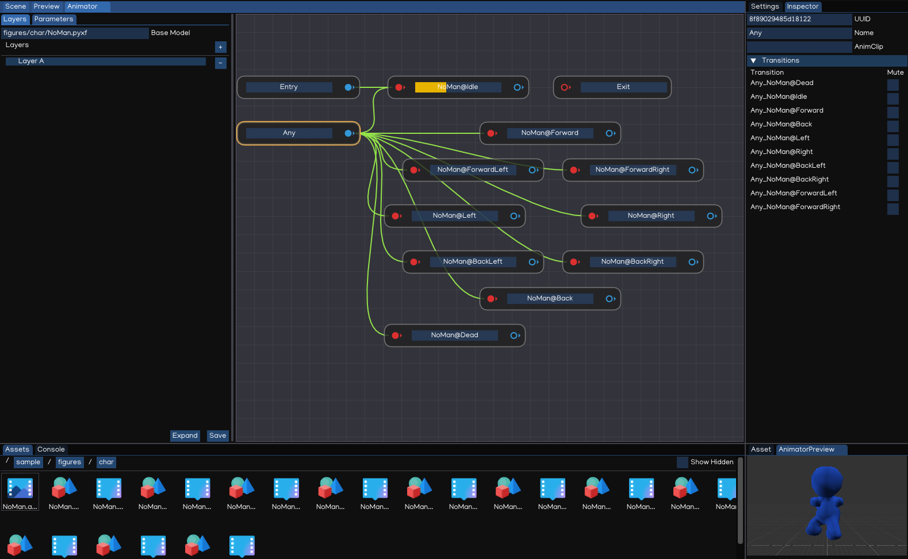
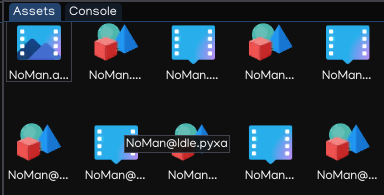
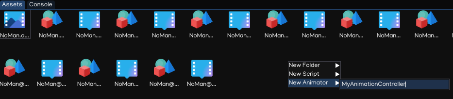
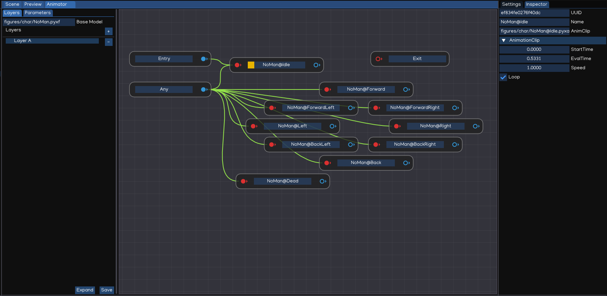
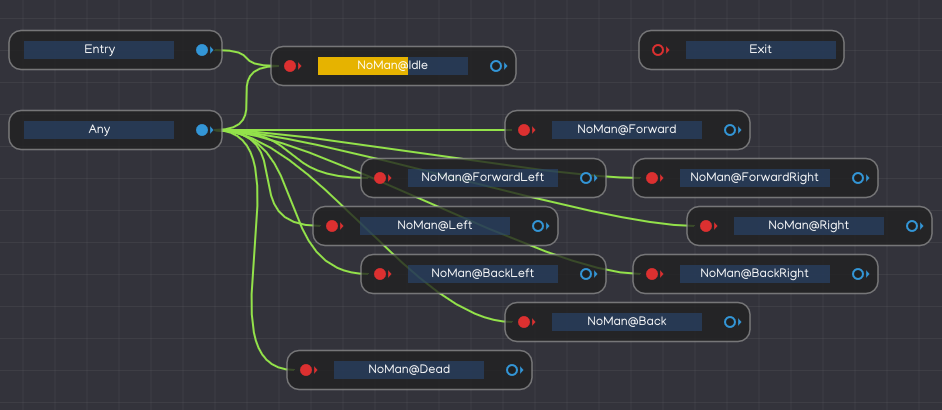
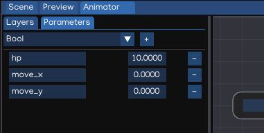
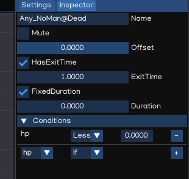

Animation
=========

IGE animation system provides:

* Easy workflow and setup of animations.
* Preview of animation clips, transitions and interactions between them.
* Management of complex interactions between animations with a visual programming tool.
* Layering and masking features.

Animation Clips
---------------

**Animation Clips** are one of the core elements to IGE animation system, which are imported from external sources such as animation from Blender®, Autodesk® Maya®, Autodesk® 3ds Max® ... softwares. 
In ``Assets Browser``, animation clip files have ``.pyxa`` extension.

Animator Controllers
--------------------

An **Animator Controller** allows you to arrange and maintain a set of animations for a character or other animated scene objects.
The controller has references to the animation clips used within it, and manages the various animation states and the transitions between them using a ``Animation State Machine``.

To create an Animator Controller, right-click on the ``Assets Browser``, select ``New Animator``, like below:

Double-clicking the new created file will open ``Animator Window`` which can be used to create, view and modify the animator controller.

The animator controller is then finally applied to an object by attaching an ``Animator`` component that references them. See the Python API, section ``Animator`` for further details about their use.

The Animator Window
-------------------

The **Animator Window** allows you to create, view and modify ``Animator Controller`` assets.

The window contains:

* *Layout Area*: use to create, arrange and connect states in your Animator Controller.
* *Layers Area*: use to view and edit layers within Animator Controller. IGE allows to have multiple layers within a single animator controller, to control different parts of the object using separate state machine.
* *Parameters Area*: allow to create, view and edit the parameters using in Animator Controller. Those parameters are variables which act as input for the state machine, to control the transitioning condition between states.
* *Inspector*: to edit state, or transition settings.

Animation State Machines
------------------------

**Animation State Machines** represent an overview of all of the animation clips related to a particular animation object, and allow various events in the game to trigger different animations.

State Machines consist of States, Transitions and Events which together provide control overall animations behavior of a single object using ``Animator Controller``.

Animation Parameters
--------------------

Animation Parameters are variables that are defined within an ``Animator Controller`` that can be accessed and assigned values from scripts. This allow developer to control the behavior of animation system using IGE.

Parameter values can be set up using the **Parameters Area** of the **Animator Window**.

The parameters can be of four basic types:

* *Integer*: a integer number
* *Float*: a float number
* *Bool*: a true / false value
* *Trigger*: a true/false value that is reset by the controller when consumed by a transition

Parameters can be assigned values from a script using functions in the Animator class, using Python API below:

.. code:: python

   from igeScene import Script, Animator
   from igeCore.input.touch import Touch
   from igeCore.input.keyboard import KeyCode, Keyboard

   class SimpleCharacter(Script):
      def __init__(self, owner):
         super().__init__(owner)

      def onStart(self):
         self.animator = self.owner.getComponent("Animator")
         self.animator.resetTrigger("fire")

      def onUpdate(self, dt):
         x,y = Touch.getPosition(0)
         fire = Keyboard.isPressed(KeyCode.KEY_SPACE)
         self.animator.setFloat("move_x", x)
         self.animator.setFloat("moveZ_y", y)
         self.animator.setTrigger("fire", fire)

More details about ``Animator`` API, please check Python API document.

Animation transitions
---------------------

Animation transitions allow the state machine
 to switch or blend from one animation state to another. Transitions define not only how long the blend between states should take, but also under what conditions they should activate. 

Each view in the animator window has:

* *Entry*: The entry node will be evaluated first to select which state the state machine begins with, by evaluating the state of your parameters when the state machine begins.
* *Exit*: used to indicate that a state machine should exit.
* *Any*:  specify a situation where you want to go to a specific state regardless of which state you are currently in.
* *Other states*: animation states in the Animator Controller.

You can set up a transition to occur only when certain conditions are true. To set up these conditions, specify values of parameters in the Animator Controller, then setting up the transition condition in Inspector view.

.. table::
   :widths: auto

   =====================================  ==============================================
    Property                               Function
   =====================================  ==============================================
    Mute                                   Whether this transition is considered
    Offset                                 The offset to begin in the destination state
    HasExitTime                            Make transition at the specific time specified in ExitTime
    ExitTime                               Represents the exact time at which the transition can take effect
    FixedDuration                          If checked, the transition time is interpreted in seconds.
    Duration                               Transition duration (normalized time or seconds, depends on FixedDuration flag).
    Conditions	                            Transition conditions
   =====================================  ==============================================

Transition Conditions
+++++++++++++++++++++

A transition can have a single condition, multiple conditions, or no conditions at all. A condition consists of:

* An event parameter, the value of which is considered in the condition.
* A conditional predicate, if needed (for example, less or greater for floats).
* A parameter value, if needed.

If HasExitTime is enabled for the transition and has one or more conditions, these conditions are only checked after the exit time of the state. This allows you to ensure that your transition only occurs during a certain portion of the animation.
