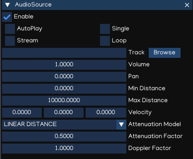
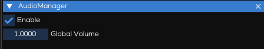

Audio
=====

Indigames engine supports playing sounds in 3D space. Sounds are emitted by objects (sources) and heard by receivers (listeners).

AudioSource
-----------

The ``AudioSource`` is used to play an audio track, at the position of the object it is attached to, in 3D space.

Indigames engine supports playing *.ogg, .wav, .mp3, .mp4* formats.

.. table::
   :widths: auto

   =====================================  ===========================================================
    Property                               Function
   =====================================  ===========================================================
    AutoPlay                               Whether auto play when loaded
    Stream                                 Should stream audio or preload to memory
    Single                                 Only one instance of this should play at the same time
    Loop                                   Enable this to make the Audio track loop
    Track                                  Audio track
    Volume                                 Volume at a distance of one meter from the AudioListener
    Pan                                    Panning value: -1 is Left, 0 is Center, 1 is Right
    Min Distance                           Audio source min distance: distance < min means max volume
    Max Distance                           Audio source max distance: distance > max means zero volume
    Velocity                               Audio source velocity

    Attenuation Model                      Attenuation model:

                                           - *NO ATTENUATION*
                                           - *INVERSE DISTANCE*
                                           - *LINEAR DISTANCE*
                                           - *EXPONENTIAL DISTANCE*

    Attenuation Factor                     Attenuation rolloff factor
    Doppler Factor                         Factor to reduce or enhance doppler effect
   =====================================  ===========================================================

Refer to Python API documents for usage of AudioSource component within Python Script.

AudioListener
-------------

The AudioListener receives input from AudioSource in the scene and plays sounds through the computer speakers. It's usually attached to the main camera.

The audio system will play through only one listener at the same time, which is fisrt enabled AudioListener available.

.. table::
   :widths: auto

   =====================================  =====================================
    Property                               Function
   =====================================  =====================================
    Enable                                 Enable/disable the audio listener
   =====================================  =====================================

Refer to Python API documents for usage of AudioListener component within Python Script.

AudioManager
------------

The ``AudioManager`` is automatically created and attached to the root object, to have the global setting of the Audio system.

.. table::
   :widths: auto

   =====================================  =====================================
    Property                               Function
   =====================================  =====================================
    Global Volume                          Global volume of audio system
   =====================================  =====================================

The AudioManager properties also can be controlled using Python Script. Refer to Python API documents for more details.
