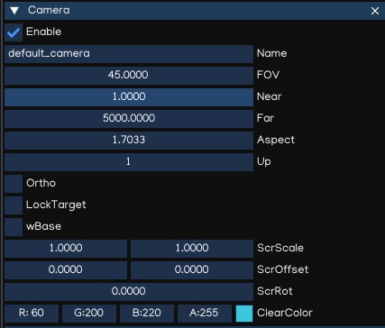
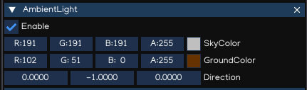
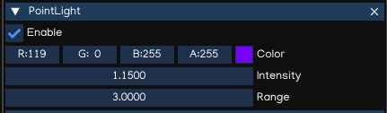
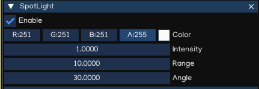
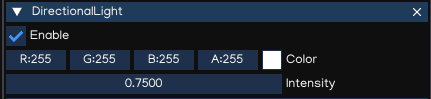
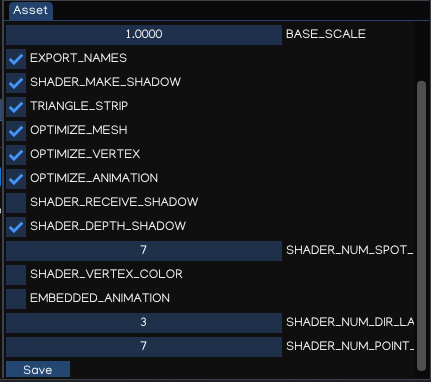
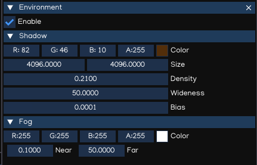

Graphics
========

IGE graphics features help to create beautiful, optimized graphics across a range of platforms, from mobile to desktop through an easy to use workflow.

Assets workflow
----------------

Graphics assets including model, animation, texture and shader can be loaded, converted and displayed using IGE.

Animation and model files such as Collada DAE and FBX are imported to IGE then converted to IGE optimized format in which:
    * ``*.pyxf``: Use for model
    * ``*.pyxa``: Use for animation

Texture files are imported and converted to:
    * ``*.pyxi``: Use for texture

Render Pipeline
----------------

The builtin render pipeline is implemented using forward rendering technique, which utilize OpenGL 3.x / OpenGLES 3.x API.

Forward rendering renders each object in one or more passes:

    * OpaquePass
    * TransparentPass
    * ShadowPass

Camera
------

A game represents game objects in a 3D space. The device's screen is 2D space, thus using camera help to capture the scene to display it in the device screen. 

Camera can be created by adding a Camera component to a game object, or using ``Create Menu -> Camera``.

Using perspective camera, objects which are far away are smaller than those nearby which is similar to the real life.
Orthographic camera is useful to display the scene where all objects appear at the same scale, like GUI or isometric view.

Camera inspector reference:

.. table::
   :widths: auto

   =====================================  =====================================
    Property                               Function
   =====================================  =====================================
    FOV                                    Field of view
    Near                                   Near clipping
    Far                                    Far clipping
    Aspect                                 Aspect ratio
    Up                                     Up vector: 0 = X, 1 = Y, 2 = Z
    **Ortho**                              Orthographic or perspective camera
    OrtW                                   Ortho width
    OrtH                                   Ortho height
    **LockTarget**                         Lock target, create follow camera
    Target                                 Position of target to follow
    wBase                                  Whether width based or heigh based scaled
    ScrScale                               Screen scale factor
    ScrOffset                              Screen offset factor
    ScrRot                                 Screen rotation factor
    ClearColor                             Color set to when clear screen
   =====================================  =====================================

Camera can be controlled by using Python API, with module ``igeScene.Camera``. Check the API document for more info.

Multiple camera also supported, but only one active camera can be used at a time (in combination with builtin GUI Camera).
To set current camera as active, use Python API as example below:

..  code:: python

    from igeScene import Script

    class GameManager(Script):
        def __init__(self, owner):
            super().__init__(owner)

        def onUpdate(self, dt):
            # find a camera and set it active
            camera = self.owner.scene.findObjectByName("MyCamera")
            if camera is not None:
                self.owner.scene.activeCamera = camera

Lighting
--------

Ambient Light
+++++++++++++

Ambient light is diffuse environmental light that is present all around the Scene and doesn't come from any specific source object. It can be an important contributor to the overall look and brightness of a scene.

Ambient light can be useful in a number of cases, depending upon your chosen art style.
An example would be bright, cartoon-style rendering where dark shadows may be undesirable or where lighting is perhaps hand-painted into textures.
It can also be useful if you need to increase the overall brightness of a scene without adjusting individual lights.

.. table::
   :widths: auto

   =====================================  =====================================
    Property                               Function
   =====================================  =====================================
    SkyColor                               Ambient sky color
    GroundColor                            Ambient ground color
    Direction                              Ambient direction vector
   =====================================  =====================================

.. tip::
    AmbientLight component is usually attached to the root node of the object hierarchy tree, because one scene needs only one Ambient light settings.

Point Light
+++++++++++

A Point Light is located at a point in space and sends light out in all directions equally. The direction of light hitting a surface is the line from the point of contact back to the center of the light object. 

.. table::
   :widths: auto

   =====================================  =====================================
    Property                               Function
   =====================================  =====================================
    Color                                  Light color
    Intensity                              Light intensity value
    Range                                  Range of effectiveness
   =====================================  =====================================

Spot Light
++++++++++

Like a Point Light, a Spot Light has a specified location and range over which the light falls off. However, a Spot Light is constrained to an angle, resulting in a cone-shaped region of illumination.

.. table::
   :widths: auto

   =====================================  =====================================
    Property                               Function
   =====================================  =====================================
    Color                                  Light color
    Intensity                              Light intensity value
    Range                                  Range of effectiveness
    Angle                                  Constrained angle
   =====================================  =====================================

Directional Light
+++++++++++++++++

Directional Lights are useful for creating effects such as sunlight in your scenes. Behaving in many ways like the sun, directional lights can be thought of as distant light sources which exist infinitely far away. A Directional Light doesn’t have any identifiable source position and so the light object can be placed anywhere in the scene. All objects in the scene are illuminated as if the light is always from the same direction. 

By default, every new scene contains a Directional Light represents the sunlight/moonlight.

.. table::
   :widths: auto

   =====================================  =====================================
    Property                               Function
   =====================================  =====================================
    Color                                  Light color
    Intensity                              Light intensity value
   =====================================  =====================================

.. note::
    The direction of light is controlled by the rotation property of the object it attached to.

Shadows
-------

IGE uses a technique called shadow mapping to render real-time shadows.

Shadow mapping uses textures called shadow maps. Shadow map texture resolution is set to 2048x2048 by default, and can be as largest as 4096x4096.
Using larger texture result in higher quality, but it costs more VRAM and may decrease game performance.

To display shadow, ensure to have:

* Shadow caster objects has enabled casting ability.
* Shadow receiver has been enabled receiving ability.
* Directional Light is ebabled and the light direction can cast shadow from shadow casters to shadow receiver.
* Shadow parameters setup correctly.

When importing models, the ability to cast/receive shadow is disabled by default, to preserve best performance.
To enable these abilities, go to ``Assets Browser``, select the file to modify, in ``Assets`` windows, enable it's flags accordingly then save it.

The shadow parameters can be adjusted with ``Environment`` component, attached to the root node of the hierarchy.

.. table::
   :widths: auto

   =====================================  =====================================
    Property                               Function
   =====================================  =====================================
    Color                                  Shadow color
    Size                                   Shadow map texture size
    Density                                Shadow density
    Wideness                               Shadow wideness
    Bias                                   Shadow Bias value
   =====================================  =====================================

.. note::
    With current implementation, only the first DirectionalLight can cast shadow because shadow transformation depends on the light direction.

.. tip::
    Wideness and size are related, so wideness shoule be smaller as possible so it can improve shadow quality, or can use smaller size to improve performance.

Fogs
-------

IGE provide basic fog setting to simulate fog.

.. table::
   :widths: auto

   =====================================  =====================================
    Property                               Function
   =====================================  =====================================
    Color                                  Fog color
    Near                                   Fog near distance
    Far                                    Fog far distance
   =====================================  =====================================

Model
-----

Editable Model
--------------

Animation
---------

