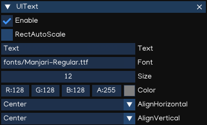

Graphical User Interface
========================

IGE includes is a set of tools for developing user interfaces for games and applications.

Canvas
------

The Canvas is a game object with a ``Canvas`` component on it. All UI elements must be children of a Canvas.
Creating a new UI element, such as an ``UIImage`` using the menu ``Create > GUI > UIImage``, automatically creates a Canvas, if there isn't already a Canvas in the scene.

.. tip::
    To work with GUI, switch the Scene Camera to 2D mode. The Canvas will be displayed as a rectangle in the view, it help to easier posioning the UI elements on the scene.

The Canvas component can be setting up using Inspector.

.. table::
   :widths: auto

   =====================================  =====================================
    Property                               Function
   =====================================  =====================================
    DesignSize                             Canvas design screen size
    TargetSize                             Target screen size (Editor only)
    ScreenMatchMode                        * *MatchWidthOrHeight*: match with width/height following a ratio
                                           * *Extend*: match the maximal screen scale ratios
                                           * *Shrink*: math the minimal screen scale ratios
   =====================================  =====================================

RectTransform
--------------

The ``RectTransform`` is a new transform component that is used for all UI elements.
It has position, rotation, and scale just like regular Transforms, but it also has a width and height, used to specify the dimensions of the rectangle.

.. table::
   :widths: auto

   =====================================  =====================================
    Property                               Function
   =====================================  =====================================
    X, Y, Z                                Position X, Y, Z
    W, H                                   Width and Height
    AnchorMin                              Lower left anchor handle
    AnchorMax                              Upper right anchor handle
    Pivot                                  Pivot position
    Rotation                               Rotation value
    Scale                                  Scale value
   =====================================  =====================================

.. tip::
    Use Z position to adjust the drawing order of elements, and may also help to resolve Z-fighting issues.

Pivot
+++++

Rotations, size, and scale modifications occur around the pivot so the position of the pivot affects the outcome of a rotation, resizing, or scaling.

Anchors
+++++++

A child ``RectTransform`` can be anchored to the parent ``RectTransform`` in various ways:

.. figure:: images/man_gui_anchor.png
   :alt: Anchor Preset

.. tip::
    The blue arrow indicates that the child will stretch together with parent size, in horizontal, vertical or both accordingly.

UI Components
-------------

With the introduction of the UI system, new Components have been added that will help you create GUI specific functionality. 

UIImage
+++++++

The ``UIImage`` component is used to display an image on screen. 

.. table::
   :widths: auto

   =====================================  =====================================
    Property                               Function
   =====================================  =====================================
    Path                                   The path to the image file
    Inteactable                            Ability to receive events using Script
    Sprite Type                            The Sprite type, can be:

                                           - *Simple*: simple Sprite
                                           - *Sliced*: 9-slices sprite

    Fill Method                            Allow to fill just part of an image by:

                                           - *Horizontal*
                                           - *Vertical*
                                           - *Radial 90*
                                           - *Radial 180*
                                           - *Radial 360*

    Fill Origin                            Fill origin, can be:
    
                                           - *Left*
                                           - *Right*
                                           - *Bottom Left*
                                           - *Bottom Right*
                                           - *Top Left*
                                           - *Top Right*

     Fill Amount                           Amount of filling, from 0.0 to 1.0.
     Clockwise                             Fill direction, clockwise or counter-clockwise
     Color                                 Diffuse color
   =====================================  =====================================

UIMask
++++++

An ``UIMask`` is not a visible UI control but rather a way to modify the appearance of a control's child elements.
The mask restricts the child elements to the shape of the parent.
So, if the child is larger than the parent then only the part of the child that fits within the parent will be visible.

.. table::
   :widths: auto

   =====================================  =====================================
    Property                               Function
   =====================================  =====================================
    Enable                                 Enable/disable mask
    Fill Method                            Allow to fill just part of an image by:

                                           - *Horizontal*
                                           - *Vertical*
                                           - *Radial 90*
                                           - *Radial 180*
                                           - *Radial 360*

    Fill Origin                            Fill origin, can be:
    
                                           - *Left*
                                           - *Right*
                                           - *Bottom Left*
                                           - *Bottom Right*
                                           - *Top Left*
                                           - *Top Right*

     Fill Amount                           Amount of filling, from 0.0 to 1.0.
     Clockwise                             Fill direction, clockwise or counter-clockwise
   =====================================  =====================================

UIText
++++++

The ``UIText`` component has a Text area for entering the text that will be displayed.
It is possible to set the font, font style and font size.
There are options to set the alignment of the text.

.. table::
   :widths: auto

   =====================================  =====================================
    Property                               Function
   =====================================  =====================================
    RectAutoScale                          Auto resize the Rect Transform with text size
    Text                                   The text to display
    Font                                   The font to display (.ttf, .otf, .pybm)
    Size                                   The font size
    Color                                  Text color
    AlignHorizontal                        Horizontal alignment
    AlignVertical                          Vertical alignment
   =====================================  =====================================

The ``UIText`` support drawing text using true-type font (.ttf, .otf) and bitmap font (.pybm) formats.

``Bitmap Font Creator`` can be used to create bitmap font, which can be found at ``Menu -> Tool -> Bitmap Font Creator``.

.. figure:: images/man_gui_bitmap_font_creator.png
   :alt: Bitmap Font Creator

.. table::
   :widths: auto

   =====================================  =====================================
    Property                               Function
   =====================================  =====================================    
    Load FontBitmap                        Load the saved bitmap font
    Save FontBitmap                        Save the bitmap font
    Image                                  Path to the image file (.pyxi)
    Characters Set                         Characters set to be generated    
    Generate Glyphs                        Generate/reset glyphs for input characters set
    Texture Size                           The image size
    Font Size                              The font size
    Font Base Size                         The font base size
    Index                                  Glyph index
    Unicode                                Character in Unicode format
    Position                               Top-left position of the character in the image
    Size                                   Size of the character
    Offset                                 Character offset
    Advance                                Character advance width
   =====================================  =====================================

To create new bitmap font, flows steps below:

- Accquire bitmap texture file which contains all the characters, copy it to ``fonts`` folder.
- Open ``Bitmap Font Creator``, select the image file.
- Input all the characters that is supported in ``Characters Set`` textbox.
- Generate glyphs by pressing ``Generate Glyphs`` button.
- For each glyphs, input the position, size, offset and advance value.
- Save the font by pressing ``Save FontBitmap`` button.
- Test the font by create ``UITextBitmap`` component, then drag and drop the newly created font in the ``Inspector`` window.

.. note::
    Bitmap font only displayed as RGB texture if background use alpha channel. Otherwise, it will render as `grayscale` color to resolve alpha issue.

.. tip::
    Saved Bitmap fonts can be modified with new characters set. Just need to add more character in the ``Characters Set`` textbox, then press ``Generate Glyphs``, it will create new glyphs without affects existing glyphs.

.. tip::
    Better to use an image editor (such as Paint.NET(R), MS Paint(R), Adobe(R) Photoshop(R)) to mesure the character attributes to put in the glyphs parameters.

UITextField
+++++++++++

``UITextField`` is used to display an editable text box to the user. The usage of this component is similar to ``UIText``, except it allows text to be input by user.

.. table::
   :widths: auto

   =====================================  =====================================
    Property                               Function
   =====================================  =====================================
    RectAutoScale                          Auto resize the Rect Transform with text size
    Text                                   The text to display
    Font                                   The font to display (.ttf, .otf, .pybm)
    Size                                   The font size
    Color                                  Text color
    Background                             Text background color
    AlignHorizontal                        Horizontal alignment
    AlignVertical                          Vertical alignment
   =====================================  =====================================

To handle the input ended event, add this code to ``Script``:

..  code:: python

   from igeScene import Script
   class TxtUserName(Script):
      def __init__(self, owner):
         super().__init__(owner)
         # Read the value from UITextField
         self.username = owner.getComponent("UITextField").text
         print(f"Welcome {self.username}!")

      # Invoked at input ended
      def onValueChanged(self, val):         
         self.username = val
         print(f"Welcome back {self.username}!")

UIButton
++++++++

The ``UIButton`` component implement a button in GUI, which responds to a click from the user and is used to initiate or confirm an action.

.. table::
   :widths: auto

   =====================================  =====================================
    Property                               Function
   =====================================  =====================================    
    Inteactable                            Ability to receive events using Script
    Transition Mode                        The transition between button states:

                                           - *Color Tint*
                                           - *Sprite Swap*

    Image                                   Background image
    Normal                                  Color/sprite of the Normal state
    Pressed                                 Color/sprite of the Pressed state
    Selected                                Color/sprite of the Selected state
    Disabled                                Color/sprite of the Disabled state
    Fade Duration                           Transition Duration
    Color                                   Diffuse color

    Sprite Type                            The Sprite type, can be:

                                           - *Simple*: simple Sprite
                                           - *Sliced*: 9-slices sprite

    Border Left                            Border left percentage
    Border Right                           Border right percentage
    Border Top                             Border top percentage
    Border Bottom                          Border bottom percentage
   =====================================  =====================================

The action can be controlled using ``Script``, which ``onClick`` callback like below:

..  code:: python

   from igeScene import Script
   class BtnNoAds(Script):
      def __init__(self, owner):
         super().__init__(owner)

      def onClick(self):
         print("NoAds Button Clicked, process purchasing...")

UISlider
++++++++

UIScrollBar
+++++++++++

UIScrollView
++++++++++++
