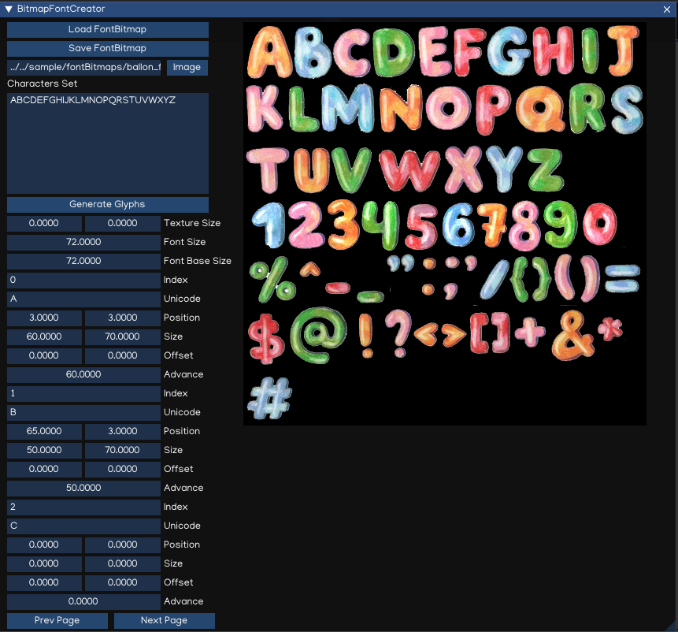

Graphical User Interface
========================

IGE includes is a set of tools for developing user interfaces for games and applications.

Canvas
------

The Canvas is a game object with a ``Canvas`` component on it, and all UI elements must be children of a Canvas.
Creating a new UI element, such as an ``Image`` using the menu ``Create > GUI > UIImage``, automatically creates a Canvas, if there isn't already a Canvas in the scene.

.. figure:: images/man_gui_canvas.png
   :alt: Canvas

.. tip::
    To work with GUI, switch the Scene Camera to 2D mode. The Canvas will be displayed as a rectangle in the view, it help to easier posioning the UI elements on the scene.

The Canvas component can be setting up using Inspector.

.. figure:: images/man_gui_canvas_inspector.png
   :alt: Canvas Inspector

.. table::
   :widths: auto

   =====================================  =====================================
    Property                               Function
   =====================================  =====================================
    DesignSize                             Canvas design screen size
    TargetSize                             Target screen size (Editor only)
    ScreenMatchMode                        * *MatchWidthOrHeight*: match with width/height following a ratio
                                           * *Extend*: match the maximal screen scale ratios
                                           * *Shrink*: math the minimal screen scale ratios
   =====================================  =====================================

RectTransform
--------------

The ``RectTransform`` is a new transform component that is used for all UI elements.
It has position, rotation, and scale just like regular Transforms, but it also has a width and height, used to specify the dimensions of the rectangle.

.. figure:: images/man_gui_recttransform.png
   :alt: RectTransform Inspector

.. table::
   :widths: auto

   =====================================  =====================================
    Property                               Function
   =====================================  =====================================
    X, Y, Z                                Position X, Y, Z
    W, H                                   Width and Height
    AnchorMin                              Lower left anchor handle
    AnchorMax                              Upper right anchor handle
    Pivot                                  Pivot position
    Rotation                               Rotation value
    scale                                  Scale value
   =====================================  =====================================

.. tip::
    Use Z position to adjust the drawing order of elements, and may also help to fix Z-fighting issues.

Pivot
+++++

Rotations, size, and scale modifications occur around the pivot so the position of the pivot affects the outcome of a rotation, resizing, or scaling.

Anchors
+++++++

If the parent of a ``RectTransform`` is also a ``RectTransform``, the child can be anchored to the parent transform in various ways.

.. tip::
    The blue arrow indicates the child will stretch together with parent size, in horizontal, vertical or both accordingly.

UI Components
-------------

With the introduction of the UI system, new Components have been added that will help you create GUI specific functionality. 

UIImage
+++++++

UIMask
++++++

UIText
++++++

The ``UIText`` component has a Text area for entering the text that will be displayed.
It is possible to set the font, font style and font size.
There are options to set the alignment of the text.

.. figure:: images/man_gui_text.png
   :alt: UIText Component

.. table::
   :widths: auto

   =====================================  =====================================
    Property                               Function
   =====================================  =====================================
    Text                                   The text to display
    Font                                   The font to display
    Size                                   The font size
    Color                                  Text color
    AlignHorizontal                        Horizontal alignment
    AlignVertical                          Vertical alignment
   =====================================  =====================================

UITextBitmap
++++++++++++

The UITextBitmap is similar to UIText, but it is rendered using Bitmap font instead.

To create a Bitmap font from a set of character images, use ``Bitmap Font Creator`` tool access in ``Menu -> Tool -> Bitmap Font Creator``.

UITextField
+++++++++++

UIButton
++++++++

UISlider
++++++++

UIScrollBar
+++++++++++

UIScrollView
++++++++++++
