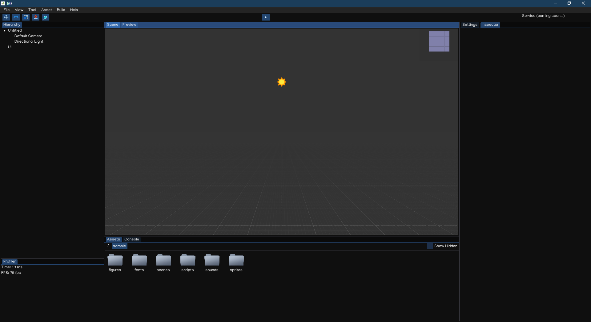

Editor Layout
==============

When launching igeCreator for the first time, you will see the Editor window similar to this:

Scene View
-----------

The Scene View is the main view of igeCreator editor. It will give you a real-time feedback of what is happening in your current scene while manipulate the objects and settings using the editor.

To asjust the view camera, use controls below:

.. table::
   :widths: auto

   =============  =================================
    Action         Input
   =============  =================================
   Select          [Mouse] Click Left Button
   Multi Select    [Mouse] Drag Left Button
   Rotate          [Mouse] Drag Right Button
   Zoom            [Mouse] Scroll Middle Button
   Move            [Mouse] Drag Middle Button   
   Focus           [Keyboard] Press `F` Key
   Copy            [Keyboard] Press `Ctrl + C` Key
   Paste           [Keyboard] Press `Ctrl + V` Key
   Delete          [Keyboard] Press `Del` Key
   =============  =================================

Game Preview
-------------

The Preview, like the Scene View, reflects what is happening in your scene, but only from a fixed camera, which correspond to your game main camera. The editor will automatically focus the Preview when playing the scene.

Menu Bar
---------

Menu Bar provides some functions to control the editor windows, as well as tools and other settings related to the scene.

Toolbar
--------

Toolbar provides controls onto your scene. It allows you to play, pause, resume, stop the game preview. It also alows changing `Gizmo` and `Camera` modes.

Hierarchy
----------

The `Hierarchy` window shows the current scene hierarchy with relations between objects. Besides, you can also create/select/delete/move/copy/paste/drag objects in this view.

Inspector
----------

In the `Inspector` you'll be able to view and edit the currently selected object. Adding, tweaking and removing components, changing object settings (name, tag, transform...).

Console
--------

Show log from the engine as well as the game so that it's easier for developer to debug.

Asset Browser
--------------
Provides access to all assets of the project. User can create/move/delete files as well as using right-clicking context menu to perform various actions. The Asset Browser allows you to drag and drop assets to places like `Scene View` to create object, or `Inspector` to configure object...

