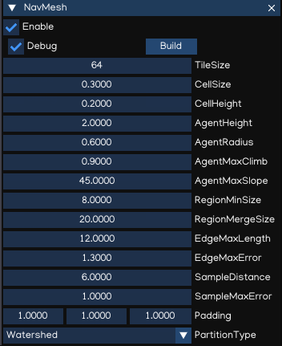
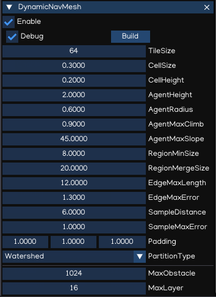

Navigation
===========

The navigation system allows you to create characters that can intelligently move around the game world, using navigation meshes that are created automatically from your Scene geometry.
Dynamic obstacles allow you to alter the navigation of the characters at runtime, while off-mesh links let you build specific actions like opening doors or jumping down from a ledge.

IGE Navigation system implement `Recast & Detour libraries <https://github.com/recastnavigation/recastnavigation>`_ which provide both navigation mesh contruction toolset and path-finding toolkit.

NavMesh
-------

NavMesh is a data structure which describes the walkable surfaces of the game world and allows to find path from one walkable location to another in the game world. The data structure is built automatically from your level geometry.

NavMesh collects geometry from its child nodes that have been tagged with the Navigable component. By default the Navigable component behaves recursively, unless the recursion is disabled.

The easiest way to make the whole scene participate in navigation mesh generation is to create the NavMesh component to the scene root node, and Navigable to the game object that act as navigating routes.

The navigation mesh generation must be triggered manually by pressing "Build" button which canbe found in NavMesh inspector window.

.. table::
   :widths: auto

   =====================================  =====================================
    Property                               Function
   =====================================  =====================================    
    Debug                                  Draw debug
    Build                                  Build NavMesh data
    TileSize                               The width/height size of tile's on the xz-plane
    CellSize                               The xz-plane cell size to use for fields
    CellHeight                             The y-axis cell size to use for fields
    AgentHeight                            Agent height
    AgentRadius                            Agent radius
    AgenMaxClimb                           Maximum ledge height that is considered to still be traversable
    AgentMaxSlope                          The maximum slope that is considered walkable
    RegionMinSize                          The minimum number of cells allowed to form isolated island areas
    RegionMergeSize                        Regions with span count smaller than this will be merged with larger regions
    EdgeMaxLength                          The maximum allowed length for contour edges along the border of the mesh
    EdgeMaxError                           The maximum distance a contour's border edges should deviate original contour
    SampleDistance                         The sampling distance to use when generating the detail mesh
    SampleMaxError                         The maximum distance the detail mesh surface should deviate from heightfield
    Padding                                The bounding box padding to generate navigation data
    PartitionType                          Partitioning type:

                                            - Watershed: build distance fields and regions data
                                            - Monotone: build monotone regions (faster but less accurate)
   =====================================  =====================================

.. note::
    NavMesh does not support NavObstacle to be added dynamictically at runtime. So, it's better to be used with static geometry only.

DynamicNavMesh
--------------

DynamicNavMesh supports the addition and removal of dynamic obstacles.
Using DynamicNavMesh has the trade-off over traditional NavMesh is that it will cost almost twice the memory consumption.
However, the addition and removal of obstacles is significantly faster than partially rebuilding a NavMesh.

.. table::
   :widths: auto

   =====================================  =====================================
    Property                               Function
   =====================================  =====================================    
    Debug                                  Draw debug
    Build                                  Build NavMesh data
    TileSize                               The width/height size of tile's on the xz-plane
    CellSize                               The xz-plane cell size to use for fields
    CellHeight                             The y-axis cell size to use for fields
    AgentHeight                            Agent height
    AgentRadius                            Agent radius
    AgenMaxClimb                           Maximum ledge height that is considered to still be traversable
    AgentMaxSlope                          The maximum slope that is considered walkable
    RegionMinSize                          The minimum number of cells allowed to form isolated island areas
    RegionMergeSize                        Regions with span count smaller than this will be merged with larger regions
    EdgeMaxLength                          The maximum allowed length for contour edges along the border of the mesh
    EdgeMaxError                           The maximum distance a contour's border edges should deviate original contour
    SampleDistance                         The sampling distance to use when generating the detail mesh
    SampleMaxError                         The maximum distance the detail mesh surface should deviate from heightfield
    Padding                                The bounding box padding to generate navigation data
    PartitionType                          Partitioning type:

                                            - Watershed: build distance fields and regions data
                                            - Monotone: build monotone regions (faster but less accurate)
    MaxObstacle                            Max number of obstacles allowed (lower is better)
    MaxLayer                               Maximum number of layers that are allowed to be constructed
   =====================================  =====================================

Navigable
---------

Navigable is a Component which tags geometry for inclusion in the navigation mesh. Optionally auto-includes geometry from child nodes.

.. table::
   :widths: auto

   =====================================  =====================================
    Property                               Function
   =====================================  =====================================    
    Recursive                              Whether geometry is collected from child nodes
   =====================================  =====================================

NavArea
-------

OffMeshLink
-----------

NavAgent
--------

NavObstacle
-----------

NavAgentManager
---------------