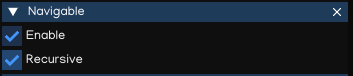

Navigation
===========

The navigation system allows you to create characters that can intelligently move around the game world, using navigation meshes that are created automatically from your Scene geometry.
Dynamic obstacles allow you to alter the navigation of the characters at runtime, while off-mesh links let you build specific actions like opening doors or jumping down from a ledge.

IGE Navigation system implement `Recast & Detour libraries <https://github.com/recastnavigation/recastnavigation>`_ which provide both navigation mesh contruction toolset and path-finding toolkit.

NavMesh
-------

NavMesh is a data structure which describes the walkable surfaces of the game world and allows to find path from one walkable location to another in the game world. The data structure is built automatically from your level geometry.

NavMesh collects geometry from its child nodes that have been tagged with the Navigable component. By default the Navigable component behaves recursively, unless the recursion is disabled.

The easiest way to make the whole scene participate in navigation mesh generation is to create the NavMesh component to the scene root node, and Navigable to the game object that act as navigating routes.

The navigation mesh generation must be triggered manually by pressing "Build" button which canbe found in NavMesh inspector window.

.. figure:: images/man_nav_navmesh.png
   :alt: NavMesh

.. table::
   :widths: auto

   =====================================  =====================================
    Property                               Function
   =====================================  =====================================    
    Debug                                  Draw debug
    Build                                  Build NavMesh data
    TileSize                               The width/height size of tile's on the xz-plane
    CellSize                               The xz-plane cell size to use for fields
    CellHeight                             The y-axis cell size to use for fields
    AgentHeight                            Agent height
    AgentRadius                            Agent radius
    AgenMaxClimb                           Maximum ledge height that is considered to still be traversable
    AgentMaxSlope                          The maximum slope that is considered walkable
    RegionMinSize                          The minimum number of cells allowed to form isolated island areas
    RegionMergeSize                        Regions with span count smaller than this will be merged with larger regions
    EdgeMaxLength                          The maximum allowed length for contour edges along the border of the mesh
    EdgeMaxError                           The maximum distance a contour's border edges should deviate original contour
    SampleDistance                         The sampling distance to use when generating the detail mesh
    SampleMaxError                         The maximum distance the detail mesh surface should deviate from heightfield
    Padding                                The bounding box padding to generate navigation data
    PartitionType                          Partitioning type:

                                            - Watershed: build distance fields and regions data
                                            - Monotone: build monotone regions (faster but less accurate)
   =====================================  =====================================

.. note::
    NavMesh does not support NavObstacle to be added dynamictically at runtime. So, it's better to be used with static geometry only.

DynamicNavMesh
--------------

DynamicNavMesh supports the addition and removal of dynamic obstacles.
Using DynamicNavMesh has the trade-off over traditional NavMesh is that it will cost almost twice the memory consumption.
However, the addition and removal of obstacles is significantly faster than partially rebuilding a NavMesh.

.. figure:: images/man_nav_dynamicnavmesh.png
   :alt: DynamicNavMesh

.. table::
   :widths: auto

   =====================================  =====================================
    Property                               Function
   =====================================  =====================================    
    Debug                                  Draw debug
    Build                                  Build NavMesh data
    TileSize                               The width/height size of tile's on the xz-plane
    CellSize                               The xz-plane cell size to use for fields
    CellHeight                             The y-axis cell size to use for fields
    AgentHeight                            Agent height
    AgentRadius                            Agent radius
    AgenMaxClimb                           Maximum ledge height that is considered to still be traversable
    AgentMaxSlope                          The maximum slope that is considered walkable
    RegionMinSize                          The minimum number of cells allowed to form isolated island areas
    RegionMergeSize                        Regions with span count smaller than this will be merged with larger regions
    EdgeMaxLength                          The maximum allowed length for contour edges along the border of the mesh
    EdgeMaxError                           The maximum distance a contour's border edges should deviate original contour
    SampleDistance                         The sampling distance to use when generating the detail mesh
    SampleMaxError                         The maximum distance the detail mesh surface should deviate from heightfield
    Padding                                The bounding box padding to generate navigation data
    PartitionType                          Partitioning type:

                                            - Watershed: build distance fields and regions data
                                            - Monotone: build monotone regions (faster but less accurate)
    MaxObstacle                            Max number of obstacles allowed (lower is better)
    MaxLayer                               Maximum number of layers that are allowed to be constructed
   =====================================  =====================================

Navigable
---------

Navigable is a Component which tags geometry for inclusion in the navigation mesh. Optionally auto-includes geometry from child nodes.

.. table::
   :widths: auto

   =====================================  =====================================
    Property                               Function
   =====================================  =====================================    
    Recursive                              Whether geometry is collected from child nodes
   =====================================  =====================================

NavArea
-------

NavArea is a utility to mark a region differentiate with others, and potential have different navigation cost to travel through.
It's useful to predefine all type of areas, such as Ground, Water, Sand, Snow ... as areaId, up to 64 different area types.
The areaId then assigned to NavArea component, to configure traversal cost for the agent to go through.

.. table::
   :widths: auto

   =====================================  =====================================
    Property                               Function
   =====================================  =====================================    
    ID                                     Area Id, from 0 - 62
   =====================================  =====================================

Navigation System supports different filters for each type of NavAgent, up to 16 types.
For each agent type, the area cost canbe configured separately, providing abilities to customize agent behaviors.

To configure area cost for each area, for each type of agent, use `Python API Document <_static/html/igeScene.html#igeScene.NavAgentManager>`_, as below:

..  code:: python

   from igeScene import Script, NavAgentManager
   from enum import Enum

   class AgentType(Enum):
      MC = 0
      NPC = 1

   class AreaType(Enum):
      GROUND = 63
      WATER = 0
      SNOW = 1

   class AgentManager(Script):
      def __init__(self, owner):
         super().__init__(owner)
         self.navAgentManager = None

      def onStart(self):         
         self.navAgentManager = owner.getComponent("NavAgentManager")
         self.navAgentManager.setAreaCost(AgentType.MC, AreaType.GROUND, 1.0)
         self.navAgentManager.setAreaCost(AgentType.MC, AreaType.WATER, 5.0)
         self.navAgentManager.setAreaCost(AgentType.MC, AreaType.SNOW, 2.0)
         self.navAgentManager.setAreaCost(AgentType.NPC, AreaType.GROUND, 1.0)
         self.navAgentManager.setAreaCost(AgentType.NPC, AreaType.WATER, 100.0)
         self.navAgentManager.setAreaCost(AgentType.NPC, AreaType.SNOW, 2.0)

.. note::
   For regions which are not marked using NavArea, it will have areaId set to 63, and areaCost set to 1, by default.

OffMeshLink
-----------

Off-Mesh Links are used to create paths crossing outside the walkable navigation mesh surface.
For example, jumping over a ditch or a fence, or opening a door before walking through it, can be all described as Off-mesh links.

To use OffMeshLink optimally, follow steps below:

#. First create two cylinders, scale to (0.1, 0.2, 0.1) to make it easier to work with them.
#. Move the first cylinder inside the first NavMesh surface.
#. Move the second cylinder inside the other NavMesh surface, at the location where the link should land.
#. Select the first cylinder and add an OffMeshLink component to it.
#. Drag the second cylinder from Hierarchy to the Endpoint in the Inspector.

If the path via the off-mesh link is shorter than via walking along the Navmesh, the off-mesh link will be used.

.. table::
   :widths: auto

   =====================================  =====================================
    Property                               Function
   =====================================  =====================================    
    Endpoint                               The endpoint object, which position is the landing position.
    Bidirectional                          If enabled, the link can be traversed in either direction.
    Radius                                 Radius of the link, where the center point is object position.
    Mask                                   Off-Mesh link mask
    AreaId                                 Area Id, which pre-setup for traversal cost.
   =====================================  =====================================

NavAgent
--------

NavAgent components help you to create characters which avoid each other and obstacles while moving towards their goal.

.. table::
   :widths: auto

   =====================================  =====================================
    Property                               Function
   =====================================  =====================================    
    SyncPosition                           Update position by NavAgentManager, or not
    Radius                                 The agent's radius
    Height                                 The agent's height
    MaxAccel                               The agent's max acceleration
    MaxSpeed                               The agent's max velocity
    TargetPos                              Target position to travel to
    FilterType                             The agent's filter type
    NavQuality                             The agent's navigation quality
    NavPushiness                           The agent's navigation pushiness
   =====================================  =====================================

The NavAgent handles both the pathfinding and the movement control of a character.
In your scripts, navigation can be as simple as setting the desired destination point:

..  code:: python

   from igeScene import Script, NavAgent
   import igeVmath as vmath

   class MCAgent(Script):
      def __init__(self, owner):
         super().__init__(owner)
         self.navAgent = None

      def onStart(self):         
         self.navAgent = owner.getComponent("NavAgent")
         self.navAgent.targetPosition = vmath.vec3(10, 10, 10)

NavObstacle
-----------

NavObstacle components can be used to describe obstacles the agents should avoid while navigating.
For example the agents should avoid physics controlled objects, such as crates and barrels while moving.

To do this, add NavObstacle component to the object, then configure it's properties:

.. table::
   :widths: auto

   =====================================  =====================================
    Property                               Function
   =====================================  =====================================    
    Radius                                 The obstacle's radius
    Height                                 The obstacle's height
   =====================================  =====================================

Then the NavAgent will avoid the obstacle object while navigating, even if the object is moving around.

.. note::
   NavObstacle only works with DynamicNavMesh. It's ignored if the scene use NavMesh instead.

NavAgentManager
---------------

NavAgentManager is used to control the navigating of all NavAgents in the Scene.
It's automatically created when creating NavMesh or DynamicNavMesh, and usually added to the root object of the Scene.

.. table::
   :widths: auto

   =====================================  =====================================
    Property                               Function
   =====================================  =====================================    
    Max Agents                             Max number of agents
    Max Agent Radius                       The agent's max radius
   =====================================  =====================================

NavAgentManager also provides useful functions to control the agents by using Python Script. Refer to `Python API Document <_static/html/igeScene.html#igeScene.NavAgentManager>`_ for more information.
