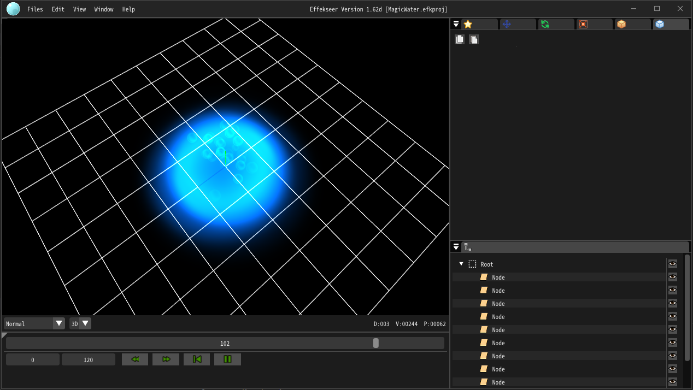
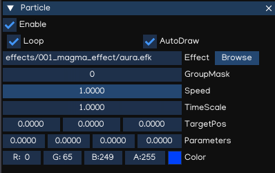
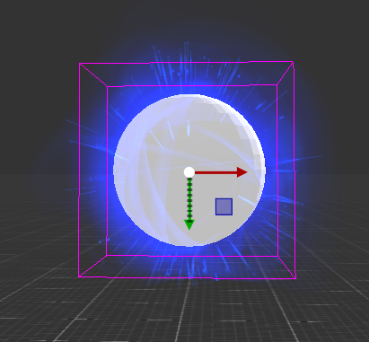
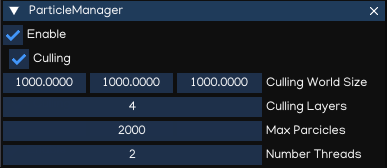

Particle System
===============

IGE Particle system implements `Effekseer <https://effekseer.github.io/en/index.html>`_, allows playing effects created with Effekseer on IGE Engine.

Effekseer Editor
----------------

Effekseer is a tool that allows easy creation of beautiful particle effects for games and movies.

Check the `Effekseer Tutorial <https://effekseer.github.io/en/documentation.html>`_ to learn how to work with Effekseer Editor.

.. note::
    IGE Engine implements Effekseer 1.60c runtime, which supports loading effects produced by the Effekseer version 1.6x.

Particle
--------

Particle component is used to load and display Effekseer effect in IGE Engine. It canbe used both in 3D and UI objects.

To add particle effects to your project, follow steps below:

#. Create effect using Effekseer Editor, or download effect from sample repo.
#. Copy your effect files (.efk), textures, sounds, materials, etc. into ``<project>/effects`` folder.
#. Add ``Particle`` component to the game object.
#. Drag & drop the .efk file to the Inspector
#. Configure the effect parameters

.. table::
   :widths: auto

   =====================================  =====================================
    Property                               Function
   =====================================  =====================================    
    Effect                                 Path to .efk file, inside ``effects`` folder
    Loop                                   Enable/disable loop
    AutoDraw                               Auto play and draw particle when loaded
    GroupMask                              Particle group mask, useful to control particles using Python Script.
    Speed                                  Playing speed
    TimeScale                              Playing time scale, also affect displaying speed
    TargetPos                              Target position (used by particle effect)
    Parameters                             Particle parameters
    Color                                  Particle diffuse color
   =====================================  =====================================

An example of using particle:

.. note::
    In UI node, the effect may appear bigger because of scaling, just need to set the scale parameter to make it reasonable.

ParticleManager
---------------

ParticleManager is used to manage Particle instance and global configuration. It is automatically added to the root object when a Particle is used.

.. table::
   :widths: auto

   =====================================  =====================================
    Property                               Function
   =====================================  =====================================    
    Culling                                Enable/disable particle culling
    Culling World Size                     Culling world size
    Culling Layers                         Number of culling layers
    Max Particles                          Max number of particle intances
    Number Threads                         Number of running threads
   =====================================  =====================================

For more information about Particle System, refer to `Effekseer Document <https://github.com/effekseer/Effekseer>`_, and `Python API Document <_static/html/igeScene.html#igeScene.ParticleManager>`_.
