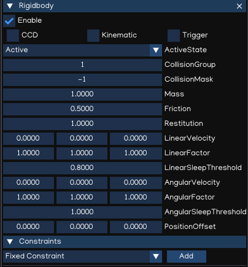
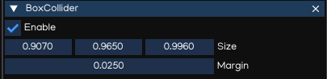
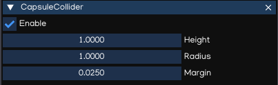
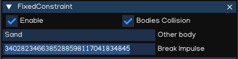
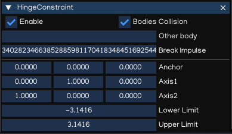
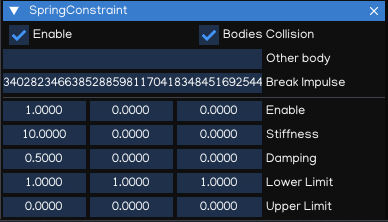
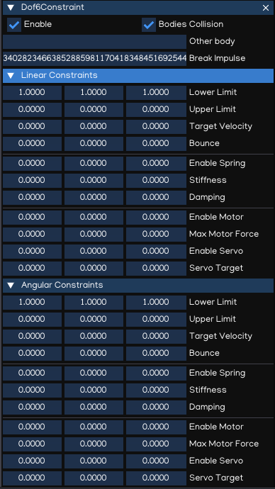
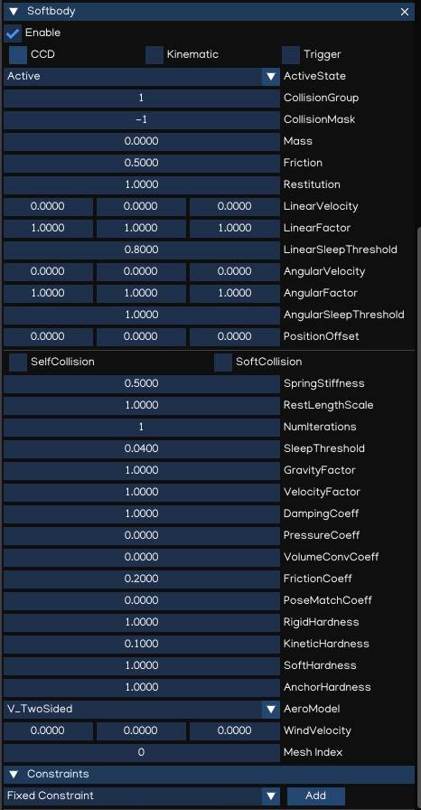
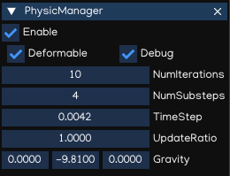

Physic
=======

IGE built-in 3D physics engine is an integration of the Bullet Physic, which is a 3D physic engine.

Rigidbody
---------

In physics simulation, rigid bodies enable physics-based behaviour such as movement, gravity, and collision. A ``Rigidbody`` is the main component that enables physical behaviour for a game object.
With a Rigidbody attached, the object will immediately respond to gravity. If one or more ``Collider`` components are also added, the game object is moved by incoming collisions.

.. table::
   :widths: auto

   =====================================  =====================================
    Property                               Function
   =====================================  =====================================    
    CCD                                    Enable/disable Continous Collision Detection mode
    Kinematic                              Set Rigidbody to Kinematic or Dynamic mode
    Trigger                                Enable trigger collision events
    ActiveState                            Set activation state
    CollisionGroup                         Collision group value
    CollisionMask                          Collision mask value
    Mass                                   The mass of the object (in kilograms by default).
    Friction                               Friction value
    Restitution                            Restitution value (aka bounciness value)
    LinearVelocity                         Linear velocity
    LinearFactor                           Linear factor
    LinearSleepThreshold                   Linear sleeping threshold
    AngularVelocity                        Angular velocity
    AngularFactor                          Angular factor
    AngularSleepThreshold                  Angular sleeping threshold
    PositionOffset                         Position offset (adjust the center of the physic object)
    Constraints                            List of constraints applied in Rigidbody
   =====================================  =====================================

.. note::
    If the game object contains Rigidbody component, it's Transform will be controlled by the Rigidbody. Thus, to change the transform just apply force or torque to the Rigidbody by using Python Script.

.. note::
    When Trigger is enabled, use Python Script to receive triggered events. Refer to Python API for more details.

Collision
---------

To configure collision between game objects, you need to use Colliders.
Colliders define the shape of the game object for the purposes of physical collisions.

BoxCollider
+++++++++++

The ``BoxCollider`` is a basic cuboid-shaped collision primitive, which are useful for items such as crates, chests, or floors using thin boxes.
It can also be used to create complex collision shape using ``CompoundCollider`` component.

.. table::
   :widths: auto

   =====================================  =====================================
    Property                               Function
   =====================================  =====================================    
    Size                                   Size of the collider in X, Y, Z direction
    Margin                                 Collision margin
   =====================================  =====================================

.. note::
    Collision margin is used to optimize physic calculation, should keep it larger than 0.

SphereCollider
++++++++++++++

The ``SphereCollider`` is a basic sphere-shaped collision primitive.

.. table::
   :widths: auto

   =====================================  =====================================
    Property                               Function
   =====================================  =====================================    
    Radius                                 The radius of the sphere shape
    Margin                                 Collision margin
   =====================================  =====================================

CapsuleColider
++++++++++++++

The ``CapsuleCollider`` is made of two half-spheres joined together by a cylinder, to create a capsule primitive shape.

.. table::
   :widths: auto

   =====================================  =====================================
    Property                               Function
   =====================================  =====================================    
    Height                                 The total height of the collider
    Radius                                 The radius of the collider width
    Margin                                 Collision margin
   =====================================  =====================================

CompoundCollider
++++++++++++++++

Compound colliders approximate the shape of an object while keeping a low processor overhead, by combining primitive colliders of the child objects.
When you create a compound collider like this, you should only use one Rigidbody component, placed on the owner object in the hierarchy.

.. note::
    CompoundCollider do not work with child objects which contains other CompoundCollider or MeshCollider.

.. note::
    Should have only one Rigidbody attached to the whole hierarchy which the root object contains both CompoundCollider and Rigidbody.
    Otherwise, the simulation may not work as designed.

MeshCollider
++++++++++++

The ``MeshCollider`` create Collider from meshes in ``FigureComponent``. It is more accurate for collision detection than using primitives colliders.

.. table::
   :widths: auto

   =====================================  =====================================
    Property                               Function
   =====================================  =====================================    
    ConvexHull                             Create and convex hull from mesh
    TriangleMesh                           Use the triangle mesh
    Margin                                 Collision margin
   =====================================  =====================================

.. note::
    Using MeshCollider results in higher processing overhead than primitive colliders, so it is best to use MeshColliders sparingly.

.. note::
    Using TriangleMesh is only allowed if the Rigidbody is Kinematic.

Constraints
-----------

A constraint is used to connect a Rigidbody to another Rigidbody or a fixed point in space. Constraints apply forces that move rigid bodies, and limits restrict that movement.

FixedConstraint
+++++++++++++++

``FixedConstraint`` restricts an object's movement to be dependent upon another object. The best scenarios for using them are when you have objects that you want to easily break apart from each other, or connect two object's movement without parenting.

.. table::
   :widths: auto

   =====================================  =====================================
    Property                               Function
   =====================================  =====================================    
    Bodies Collision                       Enable/disable collision between linked bodies
    Other body                             Other Rigidbody or Softbody component
    Break Impulse                          The force that needs to be applied for this constraint to break.
   =====================================  =====================================

HingeConstraint
+++++++++++++++

The ``HingeConstraint`` groups together two Rigidbodies, constraining them to move like they are connected by a hinge.
It is perfect for doors, but can also be used to model chains, pendulums, etc...

.. table::
   :widths: auto

   =====================================  =====================================
    Property                               Function
   =====================================  =====================================    
    Bodies Collision                       Enable/disable collision between linked bodies
    Other body                             Other Rigidbody or Softbody component
    Break Impulse                          The force that needs to be applied for this constraint to break
    Anchor                                 The position of the axis around which the body swings, in local space
    Axis1                                  Rotation around Z
    Axis2                                  Rotation around X
    Lower Limit                            The lowest angle the rotation can go
    Upper Limit                            The highest angle the rotation can go
   =====================================  =====================================

SliderConstraint
++++++++++++++++

A ``SliderConstraint`` allows a object controlled by Rigidbody to slide along a line in space, like sliding doors, for example.

   =====================================  =====================================
    Property                               Function
   =====================================  =====================================    
    Bodies Collision                       Enable/disable collision between linked bodies
    Other body                             Other Rigidbody or Softbody component
    Lower Limit                            Lower limit of the slider
    Upper Limit                            Upper limit of the slider
   =====================================  =====================================

SpringConstraint
++++++++++++++++

The ``SpringConstraint`` joins two Rigidbodies together but allows the distance between them to change as though they were connected by a spring.

.. table::
   :widths: auto

   =====================================  =====================================
    Property                               Function
   =====================================  =====================================    
    Bodies Collision                       Enable/disable collision between linked bodies
    Other body                             Other Rigidbody or Softbody component
    Enable                                 Enable/disable spring on X, Y, Z axis
    Stiffness                              Spring stiffness in X, Y, Z axis
    Damping                                Amount that the spring is reduced when active
    Lower Limit                            Lower limit of the distance range over which the spring will not apply any force
    Upper Limit                            Upper limit of the distance range over which the spring will not apply any force
   =====================================  =====================================

Dof6SpringConstraint
++++++++++++++++++++

``Dof6SpringConstraint`` incorporate all the functionality of the other constraint types and provide greater customization.

.. table::
   :widths: auto

   =====================================  =====================================
    Property                               Function
   =====================================  =====================================    
    Bodies Collision                       Enable/disable collision between linked bodies
    Other body                             Other Rigidbody or Softbody component
    Lower Limit                            Lower limit of the axis
    Upper Limit                            Upper limit of the axis
    Target velocity                        Target velocity
    Bounce                                 Bounciness
    Enable Spring                          Enable/disable spring
    Stiffness                              Spring stiffness value
    Damping                                Spring damping value
    Enable Motor                           Enable/disable motor
    Max Motor Force                        Max motor force
    Enable Servo                           Enable/disable Servo
    Servo Target                           Servo target
   =====================================  =====================================

The first 3 dof axis are linear axis, which represent translation of rigidbodies,
and the latter 3 dof axis represent the angular motion. Each axis can be either locked, free or limited.

For each axis:
- Lowerlimit == Upperlimit -> axis is locked.
- Lowerlimit > Upperlimit -> axis is free.
- Lowerlimit < Upperlimit -> axis is limted in this range.

Check Bullet Physic manual document for more information.

Softbody
--------

The soft body dynamics provides rope, cloth simulation and volumetric soft bodies, on top of the existing rigid body dynamics.
The Softbody component works with FigureComponent, it manipulates Figure meshes to simulate deformable objects like cloth, fluid, jelly,...

.. table::
   :widths: auto

   =====================================  =====================================
    Property                               Function
   =====================================  =====================================
    CCD                                    Enable/disable Continous Collision Detection mode
    Kinematic                              **[Ignored]** Softbody is Dynamic object as alway.
    Trigger                                Enable trigger collision events
    ActiveState                            Set activation state
    CollisionGroup                         Collision group value
    CollisionMask                          Collision mask value
    Mass                                   The mass of the object (in kilograms by default).
    Friction                               Friction value
    Restitution                            Restitution value (aka bounciness value)
    LinearVelocity                         Linear velocity
    LinearFactor                           Linear factor
    LinearSleepThreshold                   Linear sleeping threshold
    AngularVelocity                        Angular velocity
    AngularFactor                          Angular factor
    AngularSleepThreshold                  Angular sleeping threshold
    PositionOffset                         **[Ignored]** Use mesh data without offset
    SelfCollision                          Enable/disable collision between parts of the shape
    SoftCollision                          Enable/disable soft collision
    SpringStiffness                        Spring stiffness value
    RestLengthScale                        Scale resting length of all springs
    NumIterations                          Positions solver iterations (pIterations)
    SleepThreshold                         Sleeping threshold
    GravityFactor                          Gravity factor
    VelocityFactor                         Velocities correction factor (kVCF)
    DampingCoeff                           Damping coefficient value (kDP)
    PressureCoeff                          Pressure coefficient value (kPR)
    VolumeConvCoeff                        Volume conversation coefficient [kVC]
    FrictionCoeff                          Dynamic friction coefficient (kDF)
    PoseMatchCoeff                         Pose matching coefficient (kMT)
    RigidHardness                          Rigid contacts hardness (kCHR)
    KineticHardness                        Kinetic contacts hardness (kKHR)
    SoftHardness                           Soft contacts hardness (kSHR)
    AnchorHardness                         Anchors hardness (kAHR)
    AeroModel                              Aerodynamic model (default: V_Point)

                                           - V_Point: Vertex normals are oriented toward velocity
                                           - V_TwoSided: Vertex normals are flipped to match velocity
                                           - V_TwoSidedLiftDrag: Vertex normals are flipped to match velocity and lift and drag forces are applied.
                                           - V_OneSided: Vertex normals are taken as it is
                                           - F_TwoSided: Face normals are flipped to match velocity
                                           - F_TwoSidedLiftDrag: Face normals are flipped to match velocity and lift and drag forces are applied
                                           - F_OneSided: Face normals are taken as it is

    WindVelocity                           Wind velocity for interaction with the air
    Constraints                            List of constraints applied   
   =====================================  =====================================

Softbody also works with all type of Constraints, together with Rigidbodies or other Softbodies.

Check Bullet Physic manual document for more information.

PhysicManager
-------------

The ``PhysicManager`` is automatically created and attached to the root object, to have the global setting of the Physic system.

.. table::
   :widths: auto

   =====================================  =====================================
    Property                               Function
   =====================================  =====================================    
    Deformable                             Enable/disable physic with Softbody simulation
    Debug                                  Show Physic debug
    NumIterations                          Number of iterations per frame
    NumSubsteps                            Number of substeps. If NumSubSteps > 0, it will interpolate motion between fixed time step value
    TimeStep                               Fixed time step value (default: 1/60)
    UpdateRatio                            Update ratio, useful to do slow motion effect
    Gravity                                Global gravity value
   =====================================  =====================================

Please refer to Bullet Physic manual document and Python API document for more details of Physic usage using IGE.
