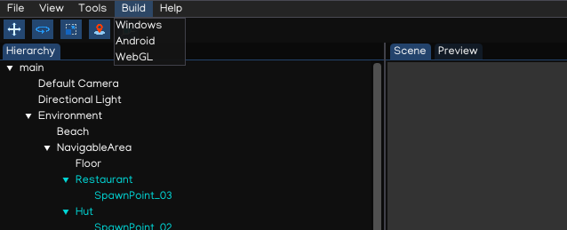
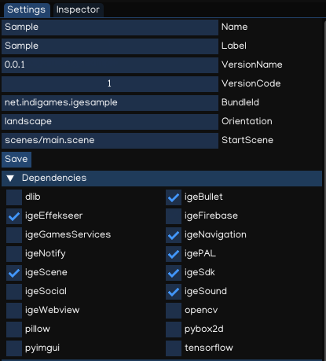
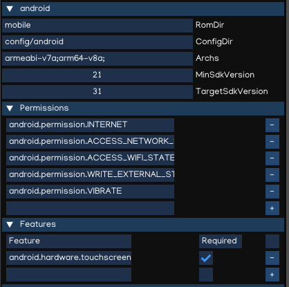
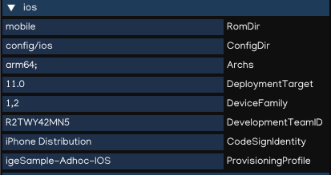

Platform Configuration
======================

IGE Creator works on Windows and MacOS workstation. The engine supports building games for Windows, MacOS, iOS, Android and WebGL platforms.

Dependencies
------------

Windows Workstation
+++++++++++++++++++

In order to work with IGE Engine on Windows machine, please make sure to install softwares below:

- Chocolatey installed from `Chocolatey <https://chocolatey.org/>`_
- Python 3.9.x, 64 bit installed
- igeCore installed with 'python -m pip install igeCore'
- Git installed
- CMake 3.18.x installed ('choco install cmake --version=3.18.1')
- Visual Studio 19 with C++ Desktop components is required for Windows runtime.
- Java SDK 11, Android Studio and Android SDK are required for Android runntime.
- MinGW ('choco install mingw') and Emscripten ('choco install emscripten') are required for WebGL runtime.

.. note::
   On Windows, igeCreator supports build for Windows, Android and WebGL platforms.

.. note::
   Please remove Python 3.10 after installing emscripten, as support Python 3.10 is not yet ready with IGE.

MacOS Workstation
+++++++++++++++++

In order to work with IGE Engine on Windows machine, please make sure to install softwares below:

- Homebrew installed
- Python 3.9.x, 64 bit installed with 'brew install python3.9'
- igeCore installed with 'python3.9 -m pip install igeCore'
- Cocoa Pod installed ('sudo gem install cocoapods')
- XCode installed
- Git client installed
- Oracle Java SDK 11, Android Studio and Android SDK are required for Android runntime.
- Emscripten ('brew install emscripten') are required for WebGL runtime.

.. note::
   The igeCreator runs on Intel-based MacOS computer only, Apple Silicon support is WIP.

.. note::
   On macOS, igeCreator supports build for macOS, iOS, Android and WebGL platforms.

Build Menu
----------

To start building for a specific platform, access the `Menu -> Build` as below:

Project Setting Panel
---------------------

Generic Configuration
+++++++++++++++++++++

.. table::
   :widths: auto

   =====================================  =====================================
    Property                               Function
   =====================================  =====================================    
    Name                                   Executable name
    Label                                  Icon label
    VersionName                            Version came
    VersionCode                            Version code
    BuldleID                               iOS bundle ID, android package name
    Orientation                            Orientation: portrait / landscape
    StartScene                             Scene to start the game with.
    Dependencies                           List of modules used by the game.
   =====================================  =====================================

Android Platform Settings
+++++++++++++++++++++++++

.. table::
   :widths: auto

   =====================================  =====================================
    Property                               Function
   =====================================  =====================================    
    RomDir                                 Rom directory, default to 'mobile'
    ConfigDir                              Config directory, default to 'config/android'
    Archs                                  Architecture, default to 'armeabi-v7a;arm64-v8a'
    MinSdkVersion                          Min Sdk Version
    TargetSdkVersion                       Target SDK Version
    Permissions                            List of required permissions
    Features                               List of using features
   =====================================  =====================================

iOS Platform Settings
+++++++++++++++++++++++

.. table::
   :widths: auto

   =====================================  =====================================
    Property                               Function
   =====================================  =====================================    
    RomDir                                 Rom directory, default to 'mobile'
    ConfigDir                              Config directory, default to 'config/ios'
    Archs                                  Architecture, default to 'arm64'
    DeploymentTarget                       Deployment target, default to '11.0'
    DeviceFamily                           Device family, default to '1,2' which mean iPhone and iPad
    DevelpomentTeamId                      Development team ID
    CodeSignIdentity                       Code sigining type: iPhone Distribution / iPhone Development
    ProvisioningProfile                    Provisioning profile, set to 'Automatic' for development build
   =====================================  =====================================
