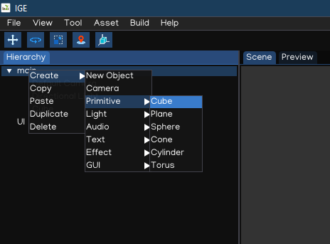
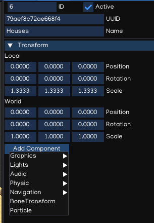
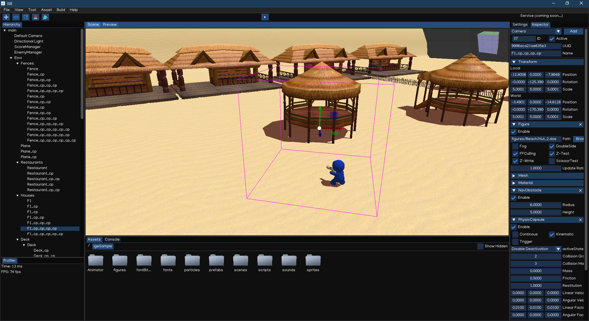
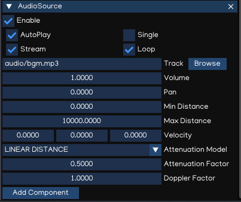
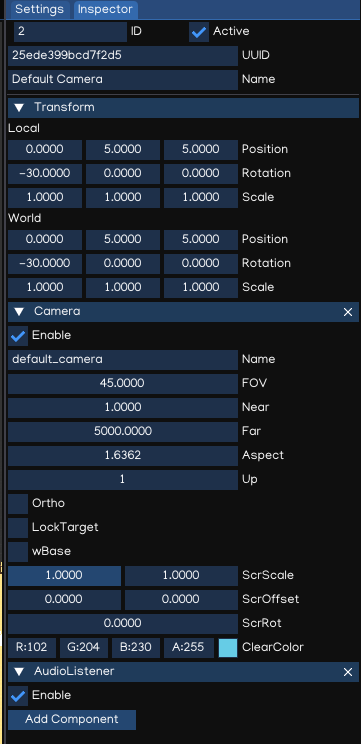
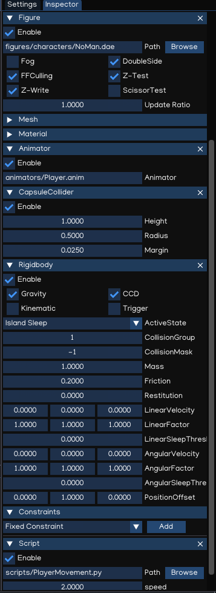
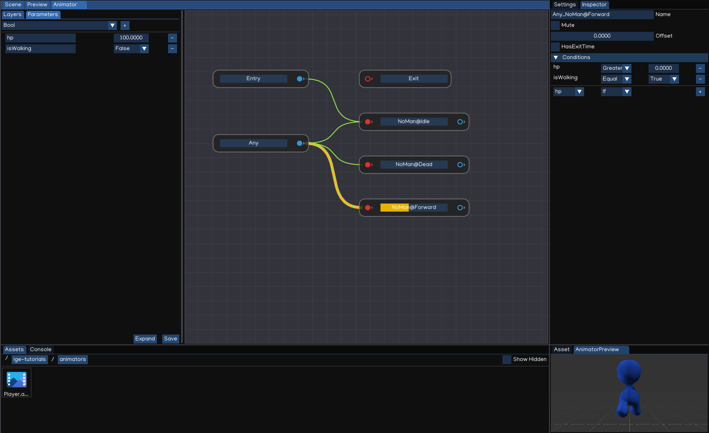
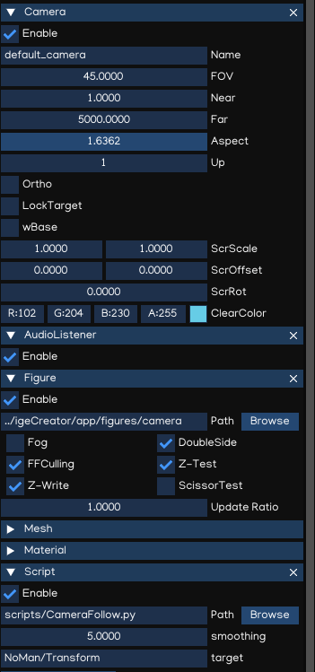
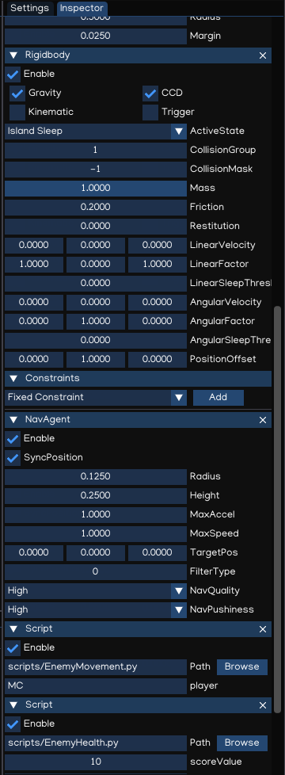

Third-Person Shooter
====================

Welcome to Indigames Game Engine tutorial series!

This tutorial will introduce how to work with IGE Engine to create a third-person shooter game.

About Scene
-----------

Before starting, let make sure you have:

- **IGE Engine**: check :doc:`gs_installation` document if you haven't have it installed.
- **ige-tutorials**: checkout `ige-tutorials <https://github.com/indigames/ige-tutorials>`_ github repo, branch `01-basic-scene`

A scene is an abstract collection of game objects, representing a part of the game's world created by using the scene editor.

IGE implements a scene structure using a Scene Object and Component system.

- The Scene Object manages the parent-child relationship of the Scene, and the spatial matrix transformation, so that all objects canbe managed and placed in the scene.
- The Component system allows Scene Object to have a variety of advanced features, such as Graphic components, Animation components, Light components, Audio components, and more.

The typical workflow of using Scene Object is to:

    - Create a Scene Object
    - Add Components
    - Write Scripts that change the properties and behaviors of these Components

Create Object
+++++++++++++

To create a game object, right click on an item in the Hierarchy , select Create, then it will show ``Object Creation Menu`` with many types of object.

Alternative, drag the assets to the Scene View, it will also create object with the type based on the file extension.

Add Components
++++++++++++++

To add a component to a scene object, select it in the Scene view or Hierarchy, then in the Inspector select ``Add Component``, it will show the ``Add Component Menu``.

Creating scene object with ``Object Creation Menu`` or by dragging assets will add component related to the object types.

Scripting
+++++++++

Indigames Game Engine allow writing Python Script to control the scene object behavior. The Script canbe attached to an object using ``ScriptComponent``.

Basic Scene
-----------

Open The Scene
++++++++++++++

Open the project using igeCreator, you will see a screen similar to this:

Scene Navigation
++++++++++++++++

Try to navigate the Scene using Scene View controls:

.. table::
   :widths: auto

   =============  =================================
    Action         Input
   =============  =================================
   Rotate          [Mouse] Drag Right Button
   Zoom            [Mouse] Scroll Middle Button
   Move            [Mouse] Drag Middle Button
   Focus           [Keyboard] Press `F` Key
   =============  =================================

Scene Management
++++++++++++++++

Try adding new game object to make the environment more beautiful, by using ``Object Creation Menu`` and dragging assets from ``figures`` folder.

Also, try to modify the environment by adjust objects' position, rotation and scale values to change the environment layout as per your preferences.

Save the Scene using ``Ctrl + S``, or ``File -> Save Scene``.

Background Music
----------------

To play an audio clip, we need to use ``AudioSource`` component, either by dragging the audio file to scene to create new object with ``AudioSource`` attached, or just to add ``AudioSource`` component to an existing object.
To make it simple, select `root` object, add ``AudioSource`` component, then drag the ``audio/bgm.mp3`` file to the inspector.
The background music should be play once loaded, and should be looped as well. To save memory, it can also be streamed.

Let's add the background music to the ``Environment`` object, like as below:

Also, ``AudioListener`` is required to act as a listener in 3D space, it's usually added to the active camera.
So, let's add ``AudioListener`` to the ``Default Camera`` object:

Save the Scene, then press `Play` button, the background music should be played and looped during the playing session.

Main Character
--------------

Checkout `ige-tutorials <https://github.com/indigames/ige-tutorials>`_ github repo, branch `02-character-movement`

Add MC
++++++

The MC prefab is located in ``prefabs/NoMan.prefab`` folder. Add the MC to the scene by dragging the prefab file in the Scene View.

In the Inspector, you can see the MC already have:
- Figure: using model from ``figures/characters/NoMan.dae``
- Animator: using animator controller from ``animators/Player.anim``
- Capsule Collider and Rigidbody for Physic simulation
- Script: movement script located at ``scripts/PlayerMovement``

Character Animation
+++++++++++++++++++

IGE Animation makes use of Animator Controller, which control the animation using State Machine defined in ``.anim`` file.

Open ``animators/Player.anim`` by double clicking the file icon in ``AssetBrowser``, the Animator Editor appears like below:

Every animator controller implements internal state machine system, which consists at least ``Entry``, ``Exit`` and ``Any`` states.
The ``Entry`` state help to configure the initial state of the animation. The ``Exit`` state is to end animation. And the ``Any`` state is a helper state to simplify the state diagram.

The player has other three states: ``Idle``, ``Move``, ``Dead``.

To decide what state to play next, the ``Parameters`` and ``Conditions`` can be used.

- ``Parameters``: define global parameters and their values.
- ``Conditions``: attached to each transition, with compare the parameters' values which predefined threshold.

The animation transition happens when all conditions are meet, or ``HasExitTime`` checked and the ``ExitTime`` value reached.

The animation is controllable using Python Script, by setting the value of the parameters at runtime.
Check the ``PlayerMovement.py`` for more information.

Character Physic
++++++++++++++++

In the Inspector, the character object includes a ``Capsule`` collider and a ``Ridgidbody``. This is a dynamic object, thus ``IsKinematic`` is set to `false`.
Notice that, the movement along `Y-Axis` is fixed, by setting the second parameter of ``LinearFactor`` to zero.
Also, the rotation along `X-Axis` and `Z-Axis` is locked, by setting the first and the thirst parameter of ``AngularFactor`` to zero.

Click ``Play`` button, then in the playing mode, the main character can be controlled by pressing arrow keys or WASD keys.
The character also has collision with the houses and other objects in the scene.

Camera Setup
------------

Checkout `ige-tutorials <https://github.com/indigames/ige-tutorials>`_ github repo, branch `03-camera-setup`

Navigate to ``Default Camera`` object, add a ``Script`` component.
Drag and drop ``scripts/CameraFollow.py`` from ``AssetBrowser`` to the newly created ``Script``.
Lastly, drag and drop the ``NoMan`` from ``Hierarchy`` to ``target`` property, then select ``Transform``.
Save the scene, and after press ``Play``, the camera will follow the main character while moving around.

Enemy NPC
---------

Checkout `ige-tutorials <https://github.com/indigames/ige-tutorials>`_ github repo, branch `04-enemy-setup`

Like the MC, the Enemy prefab is added at ``prefabs/Enemy.prefab``. Create an enemy by drag and drop the prefab to the ``Hierarchy``.

In the Inspector, the ``Enemy`` object contains:

- Figure Component: similar to MC, but the Diffuse Collor changed to Red instead of Blue.
- Animator Component: same MC
- Rigidbody and Collider: same MC
- NavAgent: use NavAgent to find and navigate the object in the map
- Script Components: ``EnemyMovement.py`` and ``EnemyHealth.py`` control the movement and heal of the enemy.

Click ``Play`` button, then the Enemy will keep running toward the MC character around the map.

GUI & HUD
---------

Checkout `ige-tutorials <https://github.com/indigames/ige-tutorials>`_ github repo, branch `05-gui-hud`

MC Health
---------

MC Shooting
-----------

Spawning Enemies
----------------

Game Over
---------
