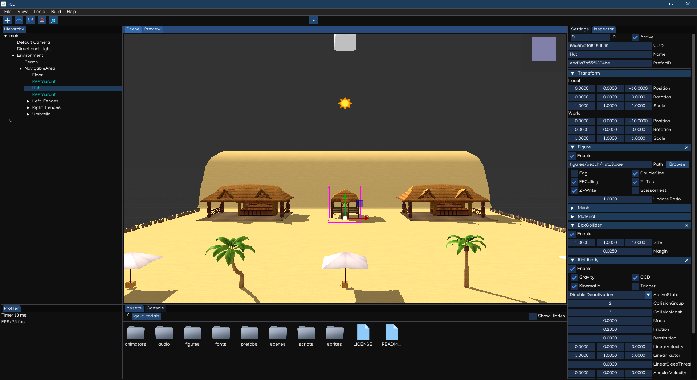

Third-Person Shooter
====================

Welcome to Indigames Game Engine tutorial series!

This tutorial will introduce how to work with IGE Engine to create a third-person shooter game.

Before starting, let make sure you have:

- **IGE Engine**: check :doc:`gs_installation` document if you haven't have it installed.
- **Tutorial Source Code**: checkout `ige-tutorials, branch 01-basic-scene <https://github.com/indigames/ige-tutorials/tree/01-basic-scene>`_ github repo.

1. About Scene
--------------

A scene is an abstract collection of game objects, representing a part of the game's world created by using the scene editor.

IGE implements a scene structure using a Scene Object and Component system.

- The Scene Object manages the parent-child relationship of the Scene, and the spatial matrix transformation, so that all objects canbe managed and placed in the scene.
- The Component system allows Scene Object to have a variety of advanced features, such as Graphic components, Animation components, Light components, Audio components, and more.

The typical workflow of using Scene Object is to:

    - Create a Scene Object
    - Add Components
    - Write Scripts that change the properties and behaviors of these Components

Create Object
+++++++++++++

To create a game object, right click on an item in the Hierarchy , select Create, then it will show ``Object Creation Menu`` with many types of object.

.. figure:: images/new_cube.png
   :alt: Object Creation Menu

Alternative, drag the assets to the Scene View, it will also create object with the type based on the file extension.

Add Components
++++++++++++++

To add a component to a scene object, select it in the Scene view or Hierarchy, then in the Inspector select ``Add Component``, it will show the ``Add Component Menu``.

Creating scene object with ``Object Creation Menu`` or by dragging assets will add component related to the object types.

Scripting
+++++++++

Indigames Game Engine allow writing Python Script to control the scene object behavior.
The Script canbe attached to an object using ``Script`` component, and canbe accesses using ``getComponent(<class_name>)`` from other scripts.

2. Scene Setup
--------------

Open The Scene
++++++++++++++

Open the project using igeCreator, you will see a screen similar to this:

Scene Navigation
++++++++++++++++

Try to navigate the Scene using Scene View controls:

.. table::
   :widths: auto

   =============  =================================
    Action         Input
   =============  =================================
   Rotate          [Mouse] Drag Right Button
   Zoom            [Mouse] Scroll Middle Button
   Move            [Mouse] Drag Middle Button
   Focus           [Keyboard] Press `F` Key
   =============  =================================

Scene Management
++++++++++++++++

Try adding new game object to make the environment more beautiful, by using ``Object Creation Menu`` and dragging assets from ``figures`` folder.

Also, try to modify the environment by adjust objects' position, rotation and scale values to change the environment layout as per your preferences.

Save the Scene using ``Ctrl + S``, or ``File -> Save Scene``.

3. Background Music
-------------------

To play an audio clip, we need to use ``AudioSource`` component, either by dragging the audio file to scene to create new object with ``AudioSource`` attached, or just to add ``AudioSource`` component to an existing object.
To make it simple, select `root` object, add ``AudioSource`` component, then drag the ``audio/bgm.mp3`` file to the inspector.
The background music should be play once loaded, and should be looped as well. To save memory, it can also be streamed.

Let's add the background music to the ``Environment`` object, like as below:

.. figure:: images/tut_3rd_shooter_bgm.png
   :alt: Background Music

Also, ``AudioListener`` is required to act as a listener in 3D space, it's usually added to the active camera.
So, let's add ``AudioListener`` to the ``Default Camera`` object:

Save the Scene, then press `Play` button, the background music should be played and looped during the playing session.

4. Character Movement
---------------------

Checkout `ige-tutorials, branch 02-character-movement <https://github.com/indigames/ige-tutorials/tree/02-character-movement>`_ github repo.

Add MC
++++++

The MC prefab is located in ``prefabs/MC.prefab`` folder. Add the MC to the scene by dragging the prefab file in the Scene View.

In the Inspector, you can see the MC already have:

- **Figure**: using model from ``figures/characters/NoMan.dae``
- **Animator**: using animator controller from ``animators/Player.anim``
- **CapsuleCollider** and **Rigidbody**: Physic simulation
- **Script**: movement script located at ``scripts/PlayerMovement``

.. figure:: images/tut_3rd_shooter_mc.png
   :alt: Main Character

Character Animation
+++++++++++++++++++

IGE Animation makes use of Animator Controller, which control the animation using State Machine defined in ``.anim`` file.

Open ``animators/Player.anim`` by double clicking the file icon in ``AssetBrowser``, the Animator Editor appears like below:

Every animator controller implements internal state machine system, which consists at least ``Entry``, ``Exit`` and ``Any`` states.
The ``Entry`` state help to configure the initial state of the animation. The ``Exit`` state is to end animation. And the ``Any`` state is a helper state to simplify the state diagram.

The player has other three states: ``Idle``, ``Move``, ``Dead``.

To decide what state to play next, the ``Parameters`` and ``Conditions`` can be used.

- ``Parameters``: define global parameters and their values.
- ``Conditions``: attached to each transition, with compare the parameters' values which predefined threshold.

The animation transition happens when all conditions are meet, or ``HasExitTime`` checked and the ``ExitTime`` value reached.

The animation is controllable using Python Script, by setting the parameters' values at runtime.

Character Physic
++++++++++++++++

In the Inspector, the character object includes a ``Capsule`` collider and a ``Ridgidbody``.
This is a dynamic object, thus ``IsKinematic`` is set to `false`.

.. note::
   Notice that, the movement along `Y-Axis` is fixed, by setting the second parameter of ``LinearFactor`` to zero. 
   Also, the rotation along `X-Axis` and `Z-Axis` is locked, by setting the first and the third parameters of ``AngularFactor`` to zero.

Character Movement Script
+++++++++++++++++++++++++

The ``PlayerMovement.py`` script is as below:

.. code:: python

   import igeVmath as vmath
   from igeCore.input.keyboard import Keyboard, KeyCode
   from igeScene import Script

   class PlayerMovement(Script):
      def __init__(self, owner):
         super().__init__(owner)
         self.speed = 2.0         
         self._transform = None
         self._rigidbody = None
         self._animator = None
         self._movement = vmath.vec3(0, 0, 0)
         self._isWalking = False

      def onStart(self):
         self._transform = self.owner.getComponent("Transform")
         self._rigidbody = self.owner.getComponent("Rigidbody")
         self._animator = self.owner.getComponent("Animator")
         self._movement = vmath.vec3(0, 0, 0)
         self._isWalking = False

      def onUpdate(self, dt):
         h, v = [0, 0]
         if Keyboard.isPressed(KeyCode.KEY_W) or Keyboard.isPressed(KeyCode.KEY_UP):
               v = -1.0
         if Keyboard.isPressed(KeyCode.KEY_S) or Keyboard.isPressed(KeyCode.KEY_DOWN):
               v = 1.0
         if Keyboard.isPressed(KeyCode.KEY_A) or Keyboard.isPressed(KeyCode.KEY_LEFT):
               h = -1.0
         if Keyboard.isPressed(KeyCode.KEY_D) or Keyboard.isPressed(KeyCode.KEY_RIGHT):
               h = 1.0
         if h != 0 or v != 0:
               self._movement = vmath.vec3(h, 0, v)
               self._movement.normalize()
               self._movement = self._movement * self.speed * dt
               newRotation = vmath.quat_look_rotation(self._movement, vmath.vec3(0.0, 1.0, 0.0))
               self._rigidbody.moveRotation(newRotation)
               self._rigidbody.movePosition(self._transform.position + self._movement)
               if not self._isWalking:
                  self._isWalking = True
                  self._animator.setValue("isWalking", self._isWalking)
         elif self._isWalking:
            self._isWalking = False
            self._animator.setValue("isWalking", self._isWalking)

      def onDestroy(self):
         self._transform = None
         self._rigidbody = None
         self._animator = None
         self._playerHealth = None
         self._movement = None

Click ``Play`` button, then in the playing mode, the main character can be controlled by pressing arrow keys or WASD keys.
The character also has collision with the houses and other objects in the scene.

5. Camera Setup
---------------

Checkout `ige-tutorials, branch 03-camera-setup <https://github.com/indigames/ige-tutorials/tree/03-camera-setup>`_ github repo.

Navigate to ``Default Camera`` object, add a ``Script`` component.
Drag and drop ``scripts/CameraFollow.py`` from ``AssetBrowser`` to the newly created ``Script``.
Lastly, drag and drop the ``NoMan`` from ``Hierarchy`` to ``target`` property, then select ``Transform``.

The ``CameraFollow.py`` script is as below:

.. code:: python

   from igeScene import Script
   import igeVmath as vmath

   class CameraFollow(Script):
      def __init__(self, owner):
         super().__init__(owner)
         self.target = None
         self.smoothing = 5.0
         self._offset = vmath.vec3()

      def onStart(self):
         if self.target is None:
               self.target = self.owner.scene.findObjectByName("MC").getComponent("Transform")
         if self.target is None:
               return
         self._offset = self.owner.transform.position - self.target.position

      def onUpdate(self, dt):
         targetCamPos = self.target.position + self._offset
         self.owner.transform.position = vmath.lerp(self.smoothing * dt, self.owner.transform.position, targetCamPos)

      def onDestroy(self):
         self.target = None
         self._offset = None

Save the scene, and after press ``Play``, the camera will follow the main character while moving around.

6. Add Enemy
------------

Checkout `ige-tutorials, branch 04-enemy-setup <https://github.com/indigames/ige-tutorials/tree/04-enemy-setup>`_ github repo.

Like the MC, the Enemy prefab is added at ``prefabs/Enemy.prefab``. Create an enemy by drag and drop the prefab to the root node in the ``Hierarchy``.

In the Inspector, the ``Enemy`` object contains:

.. figure:: images/tut_3rd_shooter_enemy.png
   :alt: Enemy Object

- **Figure**: similar to MC, but the ``Diffuse Collor`` changed to Red instead of Blue.
- **Animator**: same as MC
- **Rigidbody** and **Collider**: same as MC
- **NavAgent**: use NavAgent to find and navigate the object in the map
- **Script**: ``EnemyMovement.py`` and ``EnemyHealth.py`` control the movement and heal of the enemy.

To enable NavAgent auto targeting, we also need to setup the NavMesh. The ``DynamicNavMesh`` component is added to ``NavigableArea`` object, along with ``Navigable`` component.

The ``EnemyMovement.py`` script is as below:

.. code:: python

   from igeScene import Script
   import igeVmath as vmath

   class EnemyMovement(Script):
      def __init__(self, owner):
         super().__init__(owner)
         self.player = None
         self._transform = None
         self._navAgent = None
         self._rigidbody = None
         self._playerTransform = None
         self._playerHealth = None
         self._enemyHealth = None
         self._animator = None
         self._isWalking = False

      def onStart(self):
         self._transform = self.owner.getComponent("Transform")
         self._rigidbody = self.owner.getComponent("Rigidbody")
         self._navAgent = self.owner.getComponent("NavAgent")
         self._enemyHealth = self.owner.getComponent("EnemyHealth")
         self._animator = self.owner.getComponent("Animator")
         if self.player is None:
               self.player = self.owner.scene.findObjectByName("MC")
         if self.player is not None:
               self._playerTransform = self.player.getComponent("Transform")
               self._playerHealth = self.player.getComponent("PlayerHealth")

      def onUpdate(self, dt):
         if self._enemyHealth.hp > 0.0 and self._playerHealth.hp > 0.0:
               self._navAgent.targetPosition = self._playerTransform.position
               movement = self._playerTransform.position - self._transform.position
               movement.normalize()
               newRotation = vmath.quat_look_rotation(movement, vmath.vec3(0.0, 1.0, 0.0))
               self._rigidbody.moveRotation(newRotation)
               if not self._isWalking:
                  self._isWalking = True
                  self._animator.setValue("isWalking", self._isWalking)                  
         elif self._navAgent.hasTarget():
               self._navAgent.resetTarget()
               self._isWalking = False
               self._animator.setValue("isWalking", self._isWalking)

      def onDestroy(self):
         self.player = None
         self._transform = None
         self._navAgent = None
         self._rigidbody = None
         self._playerTransform = None
         self._playerHealth = None
         self._enemyHealth = None
         self._animator = None

The ``EnemyHealth.py`` script is as below:

.. code:: python

   from igeScene import Script

   class EnemyHealth(Script):
      def __init__(self, owner):
         super().__init__(owner)
         self.maxHp = 20.0
         self.hp = 20.0
         self.scoreValue = 10
         self.sinkSpeed = 0.5
         self.hurtSfx = None
         self.deadSfx = None
         self._transform = None
         self._animator = None
         self._navAgent = None
         self._audio = None
         self._rigidbody = None
         self._isDead = False
         self._timer = 0

      def onStart(self):
         self.hp = self.maxHp
         self._isDead = False
         self._transform = self.owner.getComponent("Transform")
         self._animator = self.owner.getComponent("Animator")
         self._navAgent = self.owner.getComponent("NavAgent")
         self._audio = self.owner.getComponent("AudioSource")
         self._rigidbody = self.owner.getComponent("Rigidbody")

      def onUpdate(self, dt):
         if self._isDead:
               self._timer += dt
               if self._timer >= 1.0:
                  self._transform.position += vmath.vec3(0, -1, 0) * self.sinkSpeed * dt
                  if (self._transform.position.y < -5.0):
                     self.owner.scene.removeObject(self.owner)

      def takeDamage(self, amount):
         self.hp -= amount
         self._animator.setValue("hp", self.hp)
         if self.hp <= 0.0:
               self.dead()
         else:
               self._audio.path = self.hurtSfx
               self._audio.play()

      def dead(self):
         if not self._isDead:
               self._isDead = True
               self._timer = 0.0
               self._navAgent.enable = False
               self._rigidbody.isKinematic = True
               self._audio.path = self.deadSfx
               self._audio.play()

      def onDestroy(self):
         self.hurtSfx = None
         self.deadSfx = None
         self._transform = None
         self._animator = None
         self._navAgent = None
         self._audio = None
         self._rigidbody = None

Click ``Play`` button, the Enemy will keep running toward the MC while he is moving around the map.

7. GUI & HUD
------------

In this section, we will add a health indicator and display score in the screen.

Add Score
+++++++++

Add ``SCORE:`` label:

- Right-click the ``UI`` node in Hierarchy, select ``Create -> GUI -> UIText``, it will create new object with UIText component
- Select the new object, rename it as ``txtScore``.
- In the Inspector, change ``Text`` to ``SCORE:``.
- Go to AssetBrowser, open ``fonts/road_font``, then drag the ``road_font.pybm`` to the ``Font`` section in Inspector.
- Change the ``Size`` to ``24``.
- Adjust the Anchor and Position like below:

Add score value textfield:

- Select ``txtScore``, right-click and select ``Create -> GUI -> UIText`` to create new textfield for score value.
- Rename the new object as ``txtScoreValue``
- Adjust the Inspector elements like image below:

Now the screen should show ``SCORE: 0`` at the middle-top of the screen. We will show the real score in the next tutorial.

Add Health Bar
++++++++++++++

We can add ``HealthUI`` object to group the UI elements related to player health:

- Right-click the ``Canvas`` object, select ``Create -> New Object``
- Name the new object as ``HealthUI``.
- Adjust the RectTransform so that it will span the whole screen.

We add heart icon to indicate the player health:

- Right-click the ``HealthUI`` object, select ``Create -> GUI -> UIImage``
- Name the new object as ``Heart``
- Drag ``sprites/heart.png`` from AssetBrowser to the Inspector
- Adjust the RectTransform to pin the icon to the top-left of the screen

We also add a Health Bar, by using UISlider component:

- Right-click the ``HealthUI`` object, select ``Create -> GUI -> UISlider``
- Name the new object as ``HealthSlider``
- The health slider is changed automatically, so we need to remove the handle, by delete ``handleArea`` child object.
- Change the background color to light-red color, by selecting ``background``, then adjust color accordingly.
- Change the fill color to light-green, by selecting ``fillArea -> fill`` object, then adjust the color to light-green
- Select the ``HealthSlider``, then adjust the RectTransform like below:

To provide graphical feedback when player is being attacked, we add a splash effect, by using UIImage component.

- Right-click the ``HealthUI`` object, select ``Create -> GUI -> UIImage``
- Name the new object as ``imgDamaged``
- Drag ``sprites/white.png`` from AssetBrowser to the Inspector
- Adjust color alpha to ``0``
- Adjust the RectTransform to span the image full screen

This should be enough to display player health and score to the screen.

Checkout `ige-tutorials, branch 05-gui-hud <https://github.com/indigames/ige-tutorials/tree/05-gui-hud>`_ github repo.

8. MC Health
------------

In this section, we will make the enemy attack, and adjust the player health on the UI accordingly.

Player Health
+++++++++++++

- In AssetBrowser, open ``prefabs/MC.prefab`` by double-clicking it.
- In AssetBrowser, create new script by navigating to ``scripts``, then right-click, select ``New Script``, enter ``PlayerHealth`` in the textfield.

The ``PlayerHealth.py`` is as below:

.. code:: python

   import igeVmath as vmath
   from igeScene import Script

   class PlayerHealth(Script):
      def __init__(self, owner):
         super().__init__(owner)
         self.maxHp = 100.0
         self.hp = 100.0
         self.healthSlider = None
         self.damageImage = None
         self.flashSpeed = 5.0
         self.deadSfx = None
         self.hurtSfx = None
         self._animator = None
         self._audio = None
         self._damaged = False

      def onStart(self):
         self._animator = self.owner.getComponent("Animator")
         self._audio = self.owner.getComponent("AudioSource")
         self.hp = self.maxHp

      def onUpdate(self, dt):
         if self._damaged:
               self.damageImage.color = vmath.vec4(1.0, 0.0, 0.0, 0.3)
         else:
               self.damageImage.color = vmath.lerp(self.flashSpeed * dt, self.damageImage.color, vmath.vec4(1.0, 0.0, 0.0, 0.0))
         self._damaged = False

      def takeDamage(self, amount):
         self._damaged = True
         self.hp -= amount
         self._animator.setValue("hp", self.hp)
         self.healthSlider.value = self.hp
         if self.hp <= 0:
               self._audio.path = self.deadSfx
               self._audio.play()
               self.owner.getComponent("PlayerMovement").enable = False
               self.owner.getComponent("PlayerShoot").enable = False
               self.owner.getComponent("PlayerHealth").enable = False
         else:
               self._audio.path = self.hurtSfx
               self._audio.play()

      def onDestroy(self):
         self.healthSlider = None
         self.damageImage = None
         self.deadSfx = None
         self.hurtSfx = None
         self._animator = None
         self._audio = None

- Select ``MC`` object, create new ``Script`` component, drag ``scripts/PlayerHealth.py`` to the path.
- Drag ``HealthSlider`` to the Inspector, in ``healthSlider`` textfield, select ``UISlider``
- Drag ``imgDamaged`` to the Inspector, in ``damageImage`` textfield, select ``UIImage``
- Drag ``audio/player_hurt.wav`` and ``audio/player_death.wav`` audio to the inspector in ``hurtSfx`` and ``deadSfx`` textfields.
- Save the prefab, select reload prefab when asked.

Enemy Attack
++++++++++++

- In AssetBrowser, open ``prefabs/Enemy.prefab`` by double-clicking it.
- In AssetBrowser, create new script by navigating to ``scripts``, then right-click, select ``New Script``, enter ``EnemyAttack`` in the textfield.
- Select ``Enemy`` object, create new ``Script`` component, drag ``scripts/EnemyAttack.py`` to the path.
- Save the prefab, select reload prefab when asked.

The ``EnemyAttack.py`` is as below:

.. code:: python

   from igeScene import Script

   class EnemyAttack(Script):
      def __init__(self, owner):
         super().__init__(owner)
         self.timeBetweenAttack = 1.0
         self.attackDamage = 10
         self._animator = None
         self._player = None
         self._playerHealth = None
         self._enemyHealth = None
         self._playerInRange = False
         self._timer = 0.0

      def onStart(self):
         self._player = self.owner.scene.findObjectByName("MC")
         if self._player is not None:
               self._playerHealth = self._player.getComponent("PlayerHealth")
         self._enemyHealth = self.owner.getComponent("EnemyHealth")
         self._animator = self.owner.getComponent("Animator")

      def onTriggerStart(self, other):
         if other == self._player:
               self._playerInRange = True

      def onTriggerStop(self, other):
         if other == self._player:
               self._playerInRange = False

      def onUpdate(self, dt):
         self._timer += dt
         if self._timer >= self.timeBetweenAttack and self._playerInRange and self._enemyHealth.hp > 0:
               self.attack()

      def attack(self):
         self._timer = 0.0
         if self._playerHealth.hp > 0:
               self._playerHealth.takeDamage(self.attackDamage)

      def onDestroy(self):
         self._animator = None
         self._player = None
         self._playerHealth = None
         self._enemyHealth = None

Save the scene, press ``Play`` button, now if player is near to the enemy, he will be attacked and his health will be updated in HUD.

Checkout `ige-tutorials, branch 06-player-health <https://github.com/indigames/ige-tutorials/tree/06-player-health>`_ github repo.

9. MC Shooting
--------------

In this section, we will equip the MC with a gun and allow him to shoot enemy.

Add Gun to MC
+++++++++++++

- In AssetBrowser, open ``prefabs/MC.prefab`` by double-clicking it.
- Select ``MC`` object, right-click, select ``New Object``, rename it to ``Gun``.
- Select ``Gun``, add ``Figure`` component, drag ``figures/weapons/Gun.dae`` to ``Path``.
- Adjust ``Transform`` component as below:

- Save the prefab.

Add Fire Particle
+++++++++++++++++

- In AssetBrowser, open ``prefabs/MC.prefab`` by double-clicking it.
- Select ``Gun``, right-click, select ``New Object``, rename it to ``fxShoot``.
- Select ``fxShoot``, create ``Particle`` component, drag ``effects/shot_effect/shot_eff.efk`` to ``Effect``.
- Adjust ``Transform`` component as below:

- Save the prefab.

Add Smoke Particle
++++++++++++++++++

- In AssetBrowser, open ``prefabs/Enemy.prefab`` by double-clicking it.
- Select ``Enemy``, right-click, select ``New Object``, rename it to ``fxSmoke``.
- Select ``fxShoot``, create ``Particle`` component, drag ``effects/smoke_effect/smoke.efk`` to ``Effect``.
- Adjust ``Transform`` component as below:

- Save the prefab.

Player Shooting
+++++++++++++++

- In AssetBrowser, open ``prefabs/MC.prefab`` by double-clicking it.
- In AssetBrowser, create new script by navigating to ``scripts``, then right-click, select ``New Script``, enter ``PlayerShoot`` in the textfield.

The ``PlayerHealth.py`` is as below:

.. code:: python

   import igeVmath as vmath
   from igeCore.input.keyboard import Keyboard, KeyCode
   from igeScene import Script

   class PlayerShoot(Script):
      def __init__(self, owner):
         super().__init__(owner)
         self.attackDamage = 20.0
         self.attackRange = 100.0
         self.timeBetweenAttack = 0.15
         self.shootSfx = None
         self.shootFx = None
         self._transform = None
         self._audio = None
         self._physic = None
         self._playerHealth = None
         self._timer = 0.0

      def onStart(self):
         self._transform = self.owner.getComponent("Transform")
         self._audio = self.owner.getComponent("AudioSource")
         self._physic = self.owner.scene.root.getComponent("PhysicManager")
         self._playerHealth = self.owner.getComponent("PlayerHealth")

      def onUpdate(self, dt):
         self._timer += dt
         if self._playerHealth.hp > 0 and Keyboard.isPressed(KeyCode.KEY_SPACE):
               self.shoot()

      def shoot(self):
         if self._timer < self.timeBetweenAttack:
               return
         self._timer = 0.0
         self._audio.path = self.shootSfx
         self._audio.play()
         self.shootFx.play()

         hit = self._physic.rayTestClosest(self._transform.position, self._transform.forward * self.attackRange)
         if hit is not None:
               hitObject = hit["hitObject"]
               hitPosition = hit["hitPosition"]
               hitPosition.y += 0.3
               enemyHealth = hitObject.getComponent("EnemyHealth")
               if enemyHealth is not None and enemyHealth.hp > 0.0:
                  enemyHealth.takeDamage(self.attackDamage)
                  smokeFx = hitObject.findChildByName("fxSmoke")
                  if smokeFx is not None:
                     smokeFx.getComponent("Transform").position = hitPosition
                     smokeFx.getComponent("Particle").play()

      def onDestroy(self):
         self.shootSfx = None
         self.shootFx = None
         self._transform = None
         self._audio = None
         self._physic = None
         self._playerHealth = None

- Select ``MC`` object, add ``Script`` component, drag ``scripts/PlayerShoot.py`` to ``Path``.
- Drag ``fxShoot`` to the Inspector, in the ``shootFx`` textfield
- Drag ``audio/player_shoot.wav`` to the ``shootSfx`` in the inspector.
- Save the prefab.

Update Score
++++++++++++

We need to add ``ScoreManager`` script to the root object to manage game score:

- In AssetBrowser, navigate to ``scripts``, create new script called ``ScoreManager.py``.

The ``ScoreManager.py`` is as simple as below:

.. code:: python

   from igeScene import Script

   class ScoreManager(Script):
      def __init__(self, owner):
         super().__init__(owner)
         self.scoreTxt = None
         self._score = 0

      def onStart(self):
         self._score = 0

      def score(self, value):
         self._score += value
         if self.scoreTxt is not None:
               self.scoreTxt.text = str(self._score)

      def onDestroy(self):
         self.scoreTxt = None

- Select ``main`` object, attach ``ScoreManager.py`` to it.
- Drag ``txtScoreValue`` from the UI to ``scoreTxt`` in the Inspector.
- Save the scene.

To add score, update ``EnemyHealth.py`` as below:

.. code:: python

   from igeScene import Script
   import igeVmath as vmath

   class EnemyHealth(Script):
      def __init__(self, owner):
         super().__init__(owner)
         self.maxHp = 20.0
         self.hp = 20.0
         self.scoreValue = 10
         self.sinkSpeed = 0.5
         self.hurtSfx = None
         self.deadSfx = None
         self._transform = None
         self._animator = None
         self._navAgent = None
         self._audio = None
         self._rigidbody = None
         self._scoreManager = None
         self._isDead = False
         self._timer = 0

      def onStart(self):
         self.hp = self.maxHp
         self._isDead = False
         self._transform = self.owner.getComponent("Transform")
         self._animator = self.owner.getComponent("Animator")
         self._navAgent = self.owner.getComponent("NavAgent")
         self._audio = self.owner.getComponent("AudioSource")
         self._rigidbody = self.owner.getComponent("Rigidbody")
         self._scoreManager = self.owner.scene.root.getComponent("ScoreManager")

      def onUpdate(self, dt):
         if self._isDead:
               self._timer += dt
               if self._timer >= 1.0:
                  self._transform.position += vmath.vec3(0, -1, 0) * self.sinkSpeed * dt
                  if (self._transform.position.y < -5.0):
                     self.owner.scene.removeObject(self.owner)

      def takeDamage(self, amount):
         self.hp -= amount
         self._animator.setValue("hp", self.hp)
         if self.hp <= 0.0:
               self.dead()
         else:
               self._audio.path = self.hurtSfx
               self._audio.play()

      def dead(self):
         if not self._isDead:
               self._isDead = True
               self._timer = 0.0
               self._navAgent.enable = False
               self._rigidbody.isKinematic = True
               self._audio.path = self.deadSfx
               self._audio.play()
               self._scoreManager.score(self.scoreValue)

      def onDestroy(self):
         self.hurtSfx = None
         self.deadSfx = None
         self._transform = None
         self._animator = None
         self._navAgent = None
         self._audio = None
         self._rigidbody = None
         self._scoreManager = None
         self._timer = None

Press ``Play`` button, the MC now can shoot enemy by pressing SPACE. Once enemy dead, the score will be added and updated in the UI.

Checkout `ige-tutorials, branch 07-player-shooting <https://github.com/indigames/ige-tutorials/tree/07-player-shooting>`_ github repo.

10. Game Over
-------------

In this section, we will spawn enemy around the map, and calculate condition to make the game over, as well as provide ability to replay the game.

Game Over UI
++++++++++++

The Game Over UI is as simple as below:

We display a layer with transparent red color, on top of that is ``Game Over`` text, and a `Replay` button to allow player to replay.
In the AssetBrowser, add new script called ``ReplayBtn.py`` in ``scripts/gui`` folder, then attach the script to the ``Replay`` button.

Spawning Enemy
++++++++++++++

We add some spawning point in the map, for examples at the ``Restaurant`` and in the ``Hut`` object. We mark the point by adding dummy objects named ``SpawnPoint_xx``.

Next, we create ``EnemyManager`` script, and attach it to the root node of the scene.

The ``EnemyManager.py`` is as below:

.. code:: python

   from igeScene import Script
   import random

   class EnemyManager(Script):
      def __init__(self, owner):
         super().__init__(owner)
         self.player = None
         self.enemyPrefab = None
         self.spawnTime = 3.0
         self.spawnPoint = None
         self.spawnPoint2 = None
         self.spawnPoint3 = None
         self._playerHealth = None
         self._spawnTimer = 0.0
         self._spawnPoints = None
         self._enemyId = 0

      def onStart(self):
         self._enemyId = 0
         if self.player is None:
               self.player = self.owner.scene.findObjectByName("MC")
               if self.player is None:
                  return
         self._playerHealth = self.player.getComponent("PlayerHealth")
         self._spawnPoints = []
         if self.spawnPoint is not None:
               self._spawnPoints.append(self.spawnPoint)
         if self.spawnPoint2 is not None:
               self._spawnPoints.append(self.spawnPoint2)
         if self.spawnPoint3 is not None:
               self._spawnPoints.append(self.spawnPoint3)

      def onUpdate(self, dt):
         self._spawnTimer += dt
         if self._spawnTimer >= self.spawnTime:
               self.spawn()

      def spawn(self):
         if self._playerHealth.hp <= 0:
               return
         spawnIndex = random.randrange(0, len(self._spawnPoints))
         self.owner.scene.loadPrefab(self.enemyPrefab, f"Enemy_{self._enemyId}", self.owner.scene.root, self._spawnPoints[spawnIndex].position)
         self._enemyId += 1
         self._spawnTimer = 0.0

      def onDestroy(self):
         self.player = None
         self.enemyPrefab = None
         self.spawnPoint = None
         self.spawnPoint2 = None
         self.spawnPoint3 = None
         self._playerHealth = None
         self._spawnPoints = None

After attaching the script:

- Drag ``MC`` to ``player`` textbox
- Drag ``prefabs/Enemy.prefab`` from AssetBrowser to ``enemyPrefab`` textbox
- Drag ``SpawnPoint_xx`` to the ``spawnPointxx`` textbox
- Save the scene.

Game Over Script
++++++++++++++++

Create new script named ``GameManager.py`` and attach to the root object.

The content of ``GameManager.py`` is as below:

.. code:: python
   
   from igeScene import Script, SceneManager

   class GameManager(Script):
      def __init__(self, owner):
         super().__init__(owner)
         self._gameOverUI = None

      def onStart(self):
         self._gameOverUI = self.owner.scene.findObjectByName("GameOverUI")
         self._gameOverUI.active = False

      def play(self):
         SceneManager.getInstance().reloadScene()

      def gameOver(self):
         self._gameOverUI.active = True

      def onDestroy(self):
         self._gameOverUI = None

When MC's health fall below zero, the ``Game Over`` screen should appear. Edit ``PlayerHealth.py`` as below:

.. code:: python
   
   from igeScene import Script, SceneManager
   import igeVmath as vmath
   from igeScene import Script

   class PlayerHealth(Script):
      def __init__(self, owner):
         super().__init__(owner)
         self.maxHp = 100.0
         self.hp = 100.0
         self.healthSlider = None
         self.damageImage = None
         self.flashSpeed = 5.0
         self.deadSfx = None
         self.hurtSfx = None
         self._animator = None
         self._audio = None
         self._damaged = False

      def onStart(self):
         self._animator = self.owner.getComponent("Animator")
         self._audio = self.owner.getComponent("AudioSource")
         self.hp = self.maxHp

      def onUpdate(self, dt):        
         if self._damaged:
               self.damageImage.color = vmath.vec4(1.0, 0.0, 0.0, 0.3)
         else:
               self.damageImage.color = vmath.lerp(self.flashSpeed * dt, self.damageImage.color, vmath.vec4(1.0, 0.0, 0.0, 0.0))
         self._damaged = False

      def takeDamage(self, amount):
         self._damaged = True
         self.hp -= amount
         self._animator.setValue("hp", self.hp)
         self.healthSlider.value = self.hp
         if self.hp <= 0:
               self._audio.path = self.deadSfx
               self._audio.play()
               self.owner.getComponent("PlayerMovement").enable = False
               self.owner.getComponent("PlayerShoot").enable = False
               self.owner.getComponent("PlayerHealth").enable = False
               self.owner.scene.root.getComponent("GameManager").gameOver()
         else:
               self._audio.path = self.hurtSfx
               self._audio.play()

      def onDestroy(self):
         self.healthSlider = None
         self.damageImage = None
         self.deadSfx = None
         self.hurtSfx = None
         self._animator = None
         self._audio = None

Replay The Game
+++++++++++++++

For this tutorial, replay the game is as simple as reload the scene from the beginning.

Edit ``ReplayBtn.py`` as below:

.. code:: python

   from igeScene import Script

   class ReplayBtn(Script):
      def __init__(self, owner):
         super().__init__(owner)

      def onUpdate(self, dt):
         pass

      def onClick(self):
         self.owner.scene.root.getComponent("GameManager").play()

Play the game now, when being attacked by enemy, if the HC's health fall below zero, the Game Over screen will be shown, and user will be able to replay the game by press ``Replay`` button.

Checkout `ige-tutorials, branch 08-game-over <https://github.com/indigames/ige-tutorials/tree/08-game-over>`_ github repo.

11. Mobile Control
------------------

On mobile device, access to Keyboard is very limited. We should add UI elements to move the player, and allow shooting with touch screen.

Shoot Button
++++++++++++

- Select ``Canvas`` object, add new ``UIButton``, name it as ``btnShoot``.
- In the Inspector, change the ``Transition Mode`` to ``Sprite Swap``.
- Set the ``Normal`` state to ``sprites/joystick/joystick_p.png``
- Set press ``Pressed`` state to ``sprites/joystick/joystick.png``
- Create new Script in ``scripts/gui``, named ``ShootBtn.py``, then attach to the ``btnShoot`` object.
- Adjust the RectTransform as below:

The content of ``ShootBtn.py`` is as below:

.. code:: python

   from igeScene import Script

   class ShootBtn(Script):
      def __init__(self, owner):
         super().__init__(owner)
         self.player = None
         self._playerShoot = None

      def onStart(self):
         if self.player is None:
            if self.player = self.owner.scene.findObjectByName("MC")
         if self.player is not None:
               self._playerShoot = self.player.getComponent("PlayerShoot")

      def onClick(self):
         if self._playerShoot is not None:
               self._playerShoot.shoot()

      def onDestroy(self):
         self.player = None
         self._playerShoot = None

Movement JoyStick
+++++++++++++++++

There is no ``JoyStick`` component, but we can make it using ``UIImage``.

- Select ``Canvas``, add new ``UIImage``, name it as ``jsMove``.
- In the Inspector, drag ``sprites/joystick/joystick.png`` to ``Path``.
- Adjust the size to ``96 x 96`` pixels.
- Adjust the RectTransform as below:

- Select ``jsMove``, add new ``UIImage``, name it as ``jsMoveCtrl``.
- In the Inspector, drag ``sprites/joystick/joystick_p.png`` to ``Path``.
- Adjust the size to ``48 x 48`` pixels.
- Create new ``Script`` in ``scripts/gui``, named ``JoyStick.py``:

.. code:: python

   from igeScene import Script
   import igeVmath as vmath
   from igeCore.input.touch import Touch

   class JoyStick(Script):
      def __init__(self, owner):
         super().__init__(owner)
         self.moveCtrl = None
         self._value = vmath.vec2(0, 0)
         self._maxSize = 0
         self._pressed = False
         self._pressedPosition = vmath.vec3(0, 1, 0)
         self._fingerId = -1
         self._transform = None
         self._scene = None

      def onStart(self):
         self._transform = self.owner.getComponent("RectTransform")
         self._maxSize = max(self._transform.size.x, self._transform.size.y) * 0.5
         self._scene = self.owner.scene
         self._value = vmath.vec2(0, 0)
         if self.moveCtrl is not None:
               self._moveTransform = self.moveCtrl.getComponent("RectTransform")

      def clamp(self, n, smallest, largest):
         return max(smallest, min(n, largest))

      def onUpdate(self, dt):
         for i in range(0, Touch.count()):
               pos = Touch.getPosition(i)
               if Touch.isPressed(i):
                  hit = self._scene.raycastUI(pos)
                  if hit["hitObject"].name == self.owner.name or hit["hitObject"].name == self.moveCtrl.name:
                     self._pressed = True
                     self._pressedPosition = hit["hitPosition"]
                     self._pressedPosition.z = 0
                     self._value = vmath.vec2(0, 0)
                     self._fingerId = Touch.getId(i)
               elif Touch.isMoved(i):
                  if self._pressed and self._fingerId == Touch.getId(i):
                     hit = self._scene.raycastUI(pos)
                     newPos = hit["hitPosition"]
                     newPos.z = 0
                     diff = hit["hitPosition"] - self._pressedPosition
                     self._pressedPosition = hit["hitPosition"]
                     if self._moveTransform is not None and self._maxSize > 0:
                           position = self._moveTransform.localPosition + diff
                           position.x = self.clamp(position.x, -self._maxSize, self._maxSize)
                           position.y = self.clamp(position.y, -self._maxSize, self._maxSize)
                           self._moveTransform.localPosition = position
                           self._value = vmath.vec2(position.x / self._maxSize, position.y / self._maxSize)
               elif Touch.isReleased(i):
                  if self._pressed and self._fingerId == Touch.getId(i):
                     self._pressed = False
                     self._fingerId = -1
                     if self._moveTransform is not None:
                           self._moveTransform.localPosition = vmath.vec3(0, 0, self._moveTransform.localPosition.z)
                           self._value = vmath.vec2(0,0)

      def getValue(self):
         return self._value

      def onDestroy(self):
         self.moveCtrl = None
         self._transform = None
         self._scene = None

- Attach the ``JoyStick.py`` to ``jsMove`` object, assign ``jsMoveCtrl`` to ``moveCtrl`` textbox.
- Adjust ``PlayerMovement.py`` as below:

.. code:: python

   import igeVmath as vmath
   from igeCore.input.keyboard import Keyboard, KeyCode
   from igeScene import Script

   class PlayerMovement(Script):
      def __init__(self, owner):
         super().__init__(owner)
         self.speed = 2.0
         self.jsMove = None
         self._movement = vmath.vec3(0, 0, 0)
         self._transform = None
         self._rigidbody = None
         self._animator = None
         self._playerHealth = None
         self._jsMoveScript = None

      def onStart(self):
         self._transform = self.owner.getComponent("Transform")
         self._rigidbody = self.owner.getComponent("Rigidbody")
         self._animator = self.owner.getComponent("Animator")
         self._playerHealth = self.owner.getComponent("PlayerHealth")
         if self.jsMove is not None:
               self._jsMoveScript = self.jsMove.getComponent("Script")

      def onUpdate(self, dt):
         if self._playerHealth.hp <= 0:
               return
         h, v = [0, 0]
         if Keyboard.isPressed(KeyCode.KEY_W) or Keyboard.isPressed(KeyCode.KEY_UP):
               v = -1.0
         if Keyboard.isPressed(KeyCode.KEY_S) or Keyboard.isPressed(KeyCode.KEY_DOWN):
               v = 1.0
         if Keyboard.isPressed(KeyCode.KEY_A) or Keyboard.isPressed(KeyCode.KEY_LEFT):
               h = -1.0
         if Keyboard.isPressed(KeyCode.KEY_D) or Keyboard.isPressed(KeyCode.KEY_RIGHT):
               h = 1.0

         if h == 0 and v == 0 and self._jsMoveScript is not None:
               mv = self._jsMoveScript.getValue()
               h = mv.x
               v = -mv.y

         if h != 0 or v != 0:
               self._movement = vmath.vec3(h, 0, v)
               self._movement.normalize()
               self._movement = self._movement * self.speed * dt
               newRotation = vmath.quat_look_rotation(self._movement, vmath.vec3(0.0, 1.0, 0.0))
               self._rigidbody.moveRotation(newRotation)
               self._rigidbody.movePosition(self._transform.position + self._movement)
               self._animator.setValue("isWalking", True)
         elif self._animator.getValue("isWalking"):
               self._animator.setValue("isWalking", False)

      def onDestroy(self):
         self.jsMove = None
         self._transform = None
         self._rigidbody = None
         self._animator = None
         self._playerHealth = None
         self._jsMoveScript = None

- Assign ``jsMove`` to ``jsMove`` textbox in Script Inspector.

Now, when play the game, the MC character will be able to controlled using the Move JoyStick, and he can shoot using Shoot button in the screen.

Checkout `ige-tutorials, branch 09-mobile-control <https://github.com/indigames/ige-tutorials/tree/09-mobile-control>`_ github repo.
