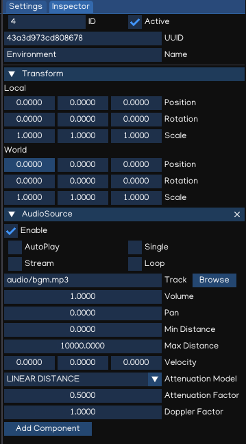

Third-Person Shooter
====================

Welcome to Indigames Game Engine tutorial series!

This tutorial will introduce how to work with IGE Engine to create a third-person shooter game.

About Scene
-----------

Before starting, let make sure you have:

- **IGE Engine**: check :doc:`gs_installation` document if you haven't have it installed.
- **ige-tutorials**: checkout `ige-tutorials <https://github.com/indigames/ige-tutorials>`_ github repo, branch `01-basic-scene`

A scene is an abstract collection of game objects, representing a part of the game's world created by using the scene editor.

IGE implements a scene structure using a Scene Object and Component system.

- The Scene Object manages the parent-child relationship of the Scene, and the spatial matrix transformation, so that all objects canbe managed and placed in the scene.
- The Component system allows Scene Object to have a variety of advanced features, such as Graphic components, Animation components, Light components, Audio components, and more.

The typical workflow of using Scene Object is to:

    - Create a Scene Object
    - Add Components
    - Write Scripts that change the properties and behaviors of these Components

Create Object
+++++++++++++

To create a game object, right click on an item in the Hierarchy , select Create, then it will show ``Object Creation Menu`` with many types of object.

.. figure:: images/new_cube.png
   :alt: Object Creation Menu

Alternative, drag the assets to the Scene View, it will also create object with the type based on the file extension.

Add Components
++++++++++++++

To add a component to a scene object, select it in the Scene view or Hierarchy, then in the Inspector select ``Add Component``, it will show the ``Add Component Menu``.

.. figure:: images/tut_3rd_shooter_add_component.png
   :alt: Add Component Menu

Creating scene object with ``Object Creation Menu`` or by dragging assets will add component related to the object types.

Scripting
+++++++++

Indigames Game Engine allow writing Python Script to control the scene object behavior. The Script canbe attached to an object using ``ScriptComponent``.

Basic Scene
-----------

Open The Scene
++++++++++++++

Open the project using igeCreator, you will see a screen similar to this:

.. figure:: images/tut_3rd_shooter_view.png
   :alt: Basic Scene View

Scene Navigation
++++++++++++++++

Try to navigate the Scene using Scene View controls:

.. table::
   :widths: auto

   =============  =================================
    Action         Input
   =============  =================================
   Rotate          [Mouse] Drag Right Button
   Zoom            [Mouse] Scroll Middle Button
   Move            [Mouse] Drag Middle Button
   Focus           [Keyboard] Press `F` Key
   =============  =================================

Scene Management
++++++++++++++++

Try adding new game object to make the environment more beautiful, by using ``Object Creation Menu`` and dragging assets from ``figures`` folder.

Also, try to modify the environment by adjust objects' position, rotation and scale values to change the environment layout as per your preferences.

Save the Scene using ``Ctrl + S``, or ``File -> Save Scene``.

Background Music
----------------

To play an audio clip, we need to use ``AudioSource`` component, either by dragging the audio file to scene to create new object with ``AudioSource`` attached, or just to add ``AudioSource`` component to an existing object.
To make it simple, select `root` object, add ``AudioSource`` component, then drag the ``audio/bgm.mp3`` file to the inspector.
The background music should be play once loaded, and should be looped as well. To save memory, it can also be streamed.

Also, ``AudioListener`` is required to act as a listener in 3D space, usually added to the active camera.

Save the Scene, then press `Play` button, the background music should be played and looped during the playing session.

Main Character
--------------

Create MC
+++++++++

The MC model is located in ``figures/characters/NoMan.dae`` folder. Add the MC to the scene by dragging the model file in the Scene View.

Create MC Animation
+++++++++++++++++++

Animation state machine:

Idle -> Move -> Dead

1. Create ``animations`` folder.

2. Create ``Animator``, name the file as Player

Camera Setup
------------

Enemy NPC
---------

GUI & HUD
---------

MC Health
---------

Shooting Enemy
--------------

Scoring Points
--------------

Spawning Enemies
----------------

Game Over
---------
